# Learnings about Back of the envelope estimations

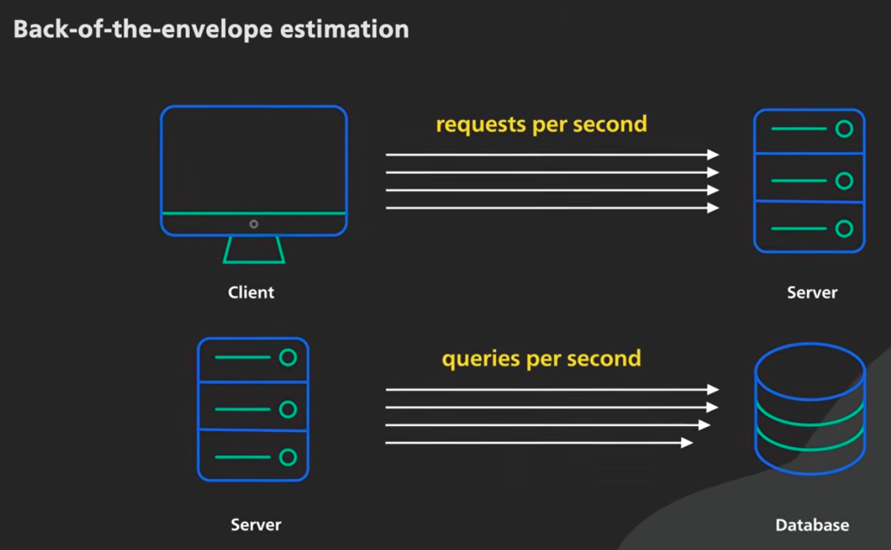

The most important metrics for the back-of-the-envelope calculation are requests per second and queries per second. Requests per second are for client-to-server communication. Query per second is server-to-database.

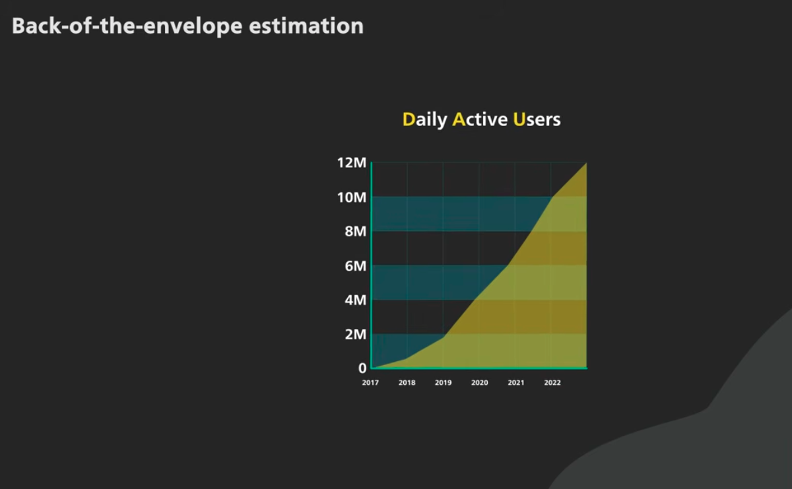

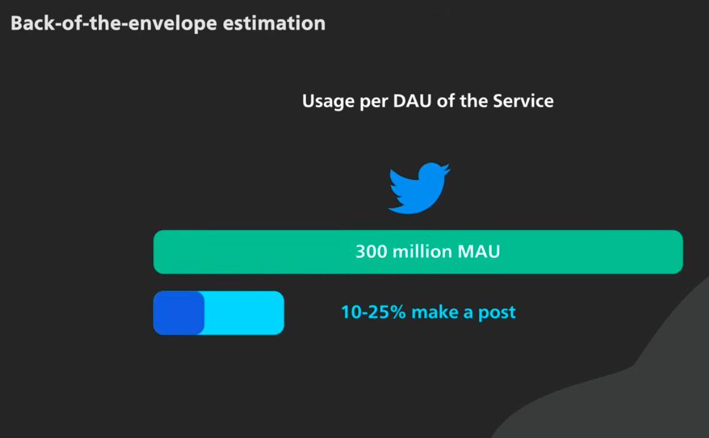

## Back of the envelope/napkin calculation with examples

video - [www.youtube.com/watch?v=Dc8uJTrGK9w](https://www.youtube.com/watch?v=Dc8uJTrGK9w)

>  it's better to be roughly right than precisely wrong

we need directional correctness

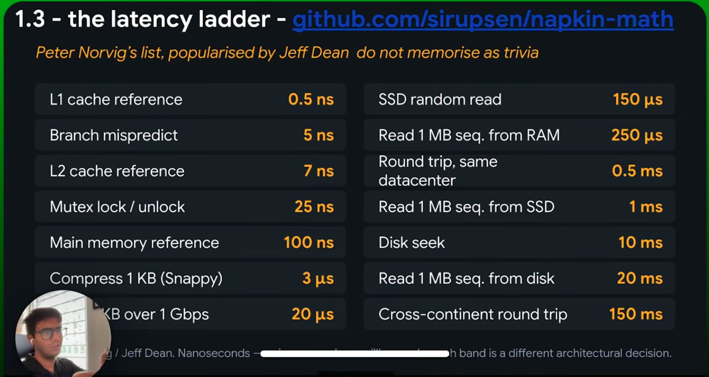

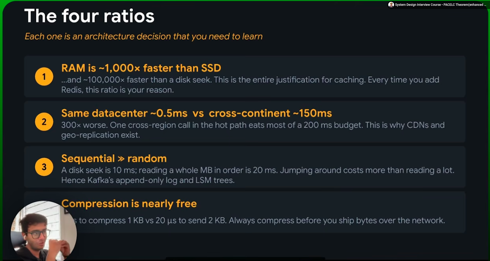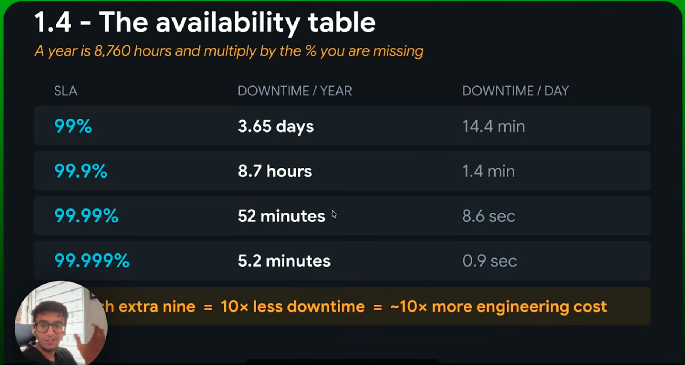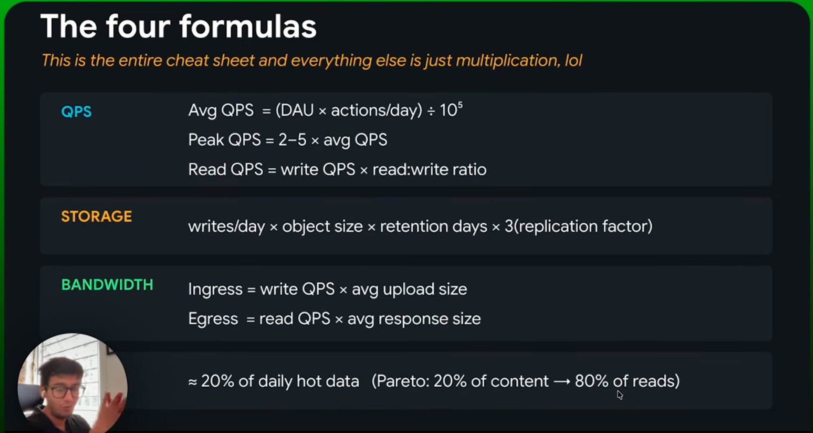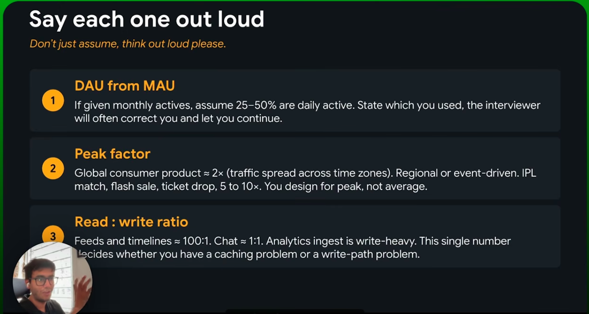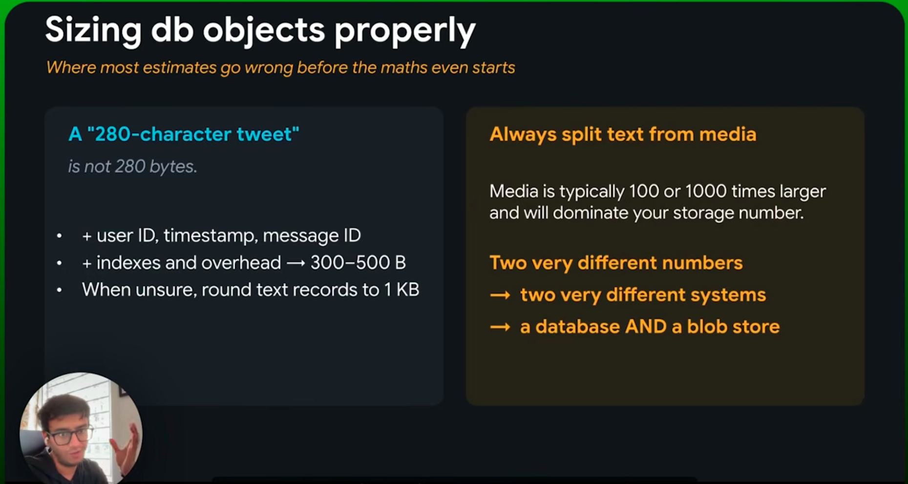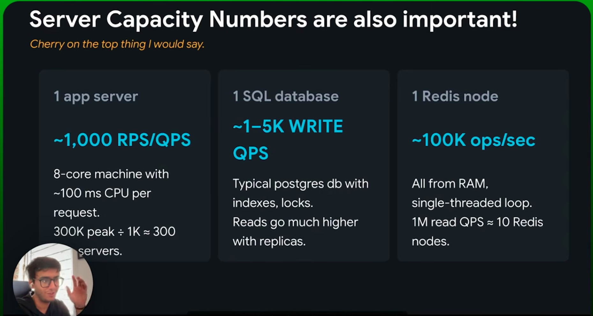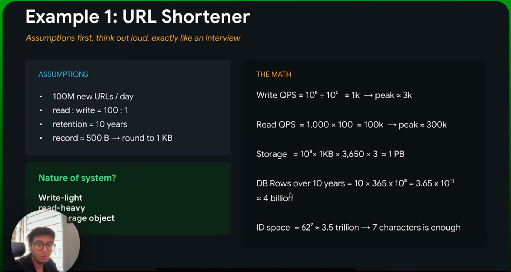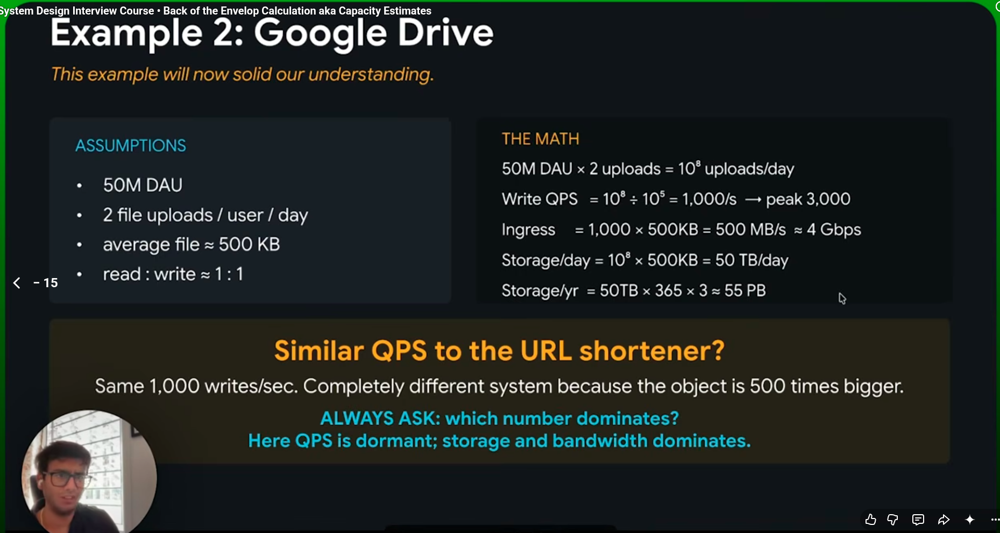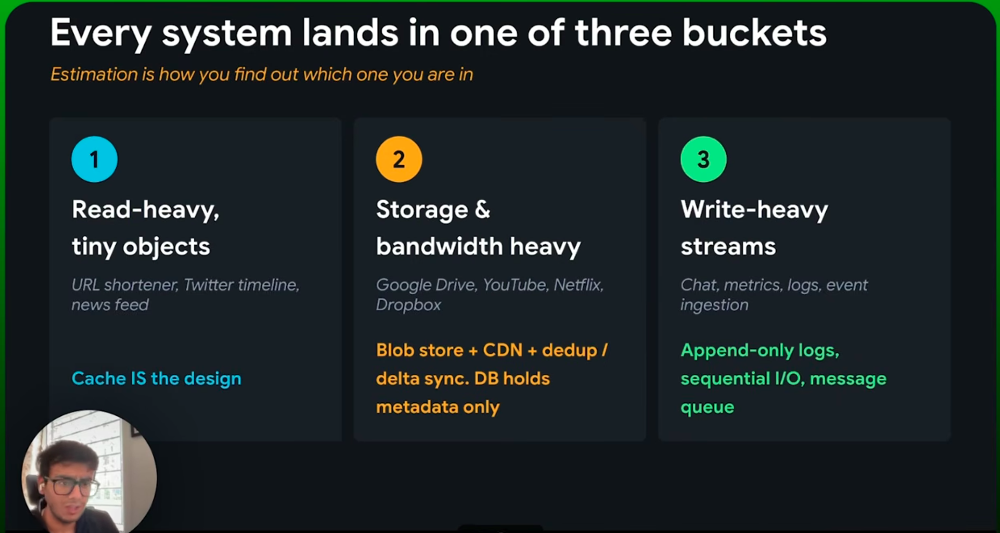
