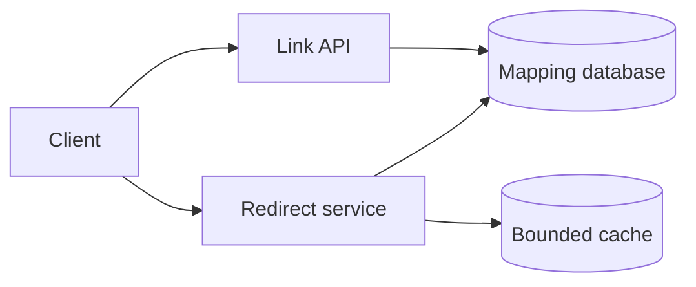

# Three worked teaching examples

These are intentionally solved examples. Predict the next decision before reading it. They use original course assumptions, not copied book solutions. Their job is to teach the **same process with different deep dives**. The later module practices use altered contracts and are unsolved until you open their answer folders.

## Example A — URL shortener: a complete first pass

### Contract

Create a short code for an HTTP(S) URL and redirect visitors. Assume targets are initially immutable, links expire after five years, one serving region, and p95 server-side lookup below 100 ms. Exclude billing and custom aliases initially. The invariant is that a live code resolves to exactly one authorized target.

Why ask about mutability? An immutable mapping can be cached much more freely. Editable/deletable links require a freshness/revocation contract. A diagram without this question can accidentally promise both permanent caching and immediate revocation.

### Size

Assume one million creations/day and 200 million redirects/day. Divide by 86,400: approximately 12 creates/s and 2,315 redirects/s. With a 5× peak, approximately 58 and 11,575/s. At 500 bytes/mapping, five years of raw mappings are `1e6 × 365 × 5 × 500 = 912.5 GB` in decimal units, before indexes/replication. Three full copies make roughly 2.74 TB before overhead.

The useful conclusion is that reads dominate and metadata is manageable with an appropriate measured deployment. These numbers do not prove sharding is necessary. Estimate cache RAM from actual distinct cached objects and overhead, not from daily redirect traffic.

### Model

`POST /links {target, request_id}` returns `{code}`; `GET /{code}` resolves. Store `code, target, owner, created_at, expires_at`. The code is a unique key. Creation retries use a durable request identity if duplicate links are undesirable. Distinguish “globally reuse the same target” from “one link per creator”; the latter keeps ownership/analytics separate.

Use a random sufficiently large code plus a database uniqueness constraint. A collision causes a new candidate and retry. A counter-based encoder is another reasonable choice but needs allocation/coordination and makes enumeration easier. Base62 is encoding, not collision prevention or encryption.

### Flow

Creation: authenticate → validate target → generate candidate → insert atomically under the unique key → return success. Redirect: check cache → on miss read mapping → check expiry/access policy → return redirect with deliberate HTTP cache headers → populate the cache only under the stated contract.

The database is the source of truth; losing cache content is recoverable. The API should not fetch an arbitrary target server-side merely to “validate” it without a destination-security policy. If analytics is needed, record a best-effort event or a durable event according to its actual contract rather than blocking every redirect on a reporting pipeline.

### Stress

**Race:** two creators choose the same code. The unique constraint rejects one insert; the application retries. Merely checking code absence before inserting is insufficient under concurrency.

**Failure:** cache disappears at peak. Load can jump from a small miss rate to all 11,575 requests/s. Add bounded fallback admission, request coalescing, warm-up, and database capacity planning. A queue on the redirect path does not make an interactive redirect acceptably fast.

**Changed requirement:** targets become editable with revocation within five seconds. Permanent client caching may violate this. Use an explicit bounded freshness policy for browser/CDN/application caches and a versioned invalidation mechanism. Do not claim a cache delete alone closes all races.

### Operate

Measure useful redirect success and lookup p95/p99, miss rate, DB query latency, and hot-code rate. Restrict management operations to the owner, add abuse reporting, and measure data growth. Roll out a new code generator with compatible readers; preserve old links. Read-serving capacity and cache behavior are likely cost/performance drivers.

### Explain

“I selected a unique-key mapping store with a cache because the workload is read-heavy. It keeps the durable contract simple. The cache improves normal load but needs a controlled failure path. We would load-test miss traffic and agree on mutable-link freshness before deployment.” Notice that the summary names reasons and limits instead of listing products.

## Example B — Rate limiter: the same frame, a different critical risk

### Contract and Size

Enforce an account limit across four API instances. Choose a **token-bucket contract**: refill at 100 tokens/minute, capacity 20, one token per request. This permits an initial burst of 20 and refills at about 1.67/s. It does **not** mean at most 100 requests in every rolling 60-second interval. Clarifying that difference determines the algorithm.

At 20,000 checked requests/s, the shared-state check is a material dependency. Request distribution and account cardinality determine state memory and hot-key risk. An account key must come from authenticated identity, not an arbitrary client-supplied header.

### Model and Flow

State per account: `(tokens, last_refill_time)`, plus rule version. Gateway → atomic shared-store operation → allow/reject → API. Inside one atomic operation: compute elapsed time with a defensible clock policy; cap refilled tokens; subtract if available; persist state; return allowed and retry information. Separate GET then SET is unsafe.

If using Redis, a suitable script can make the update atomic on the serving instance. This does not by itself guarantee durability or exact enforcement during failover, replication lag, or independent regional limiters. State those boundaries.

### Stress

With one token left, two callers may both read one and both allow. The issue is one compound admission decision; a thread lock in one gateway is insufficient. Shared atomic state resolves the normal multi-instance race. During shared-store timeout, a payment endpoint might fail closed, while a low-risk read endpoint could use a bounded local emergency budget. Unconditional fail-open removes overload protection; unconditional fail-closed can amplify an infrastructure outage.

### Operate and Explain

Monitor allow/reject rate by rule, checker latency, store errors, and downstream saturation. Do not log secrets or create unbounded per-user metric labels. Stage rule changes and retain a rollback version. Explain the precision/latency/availability trade-off; if the contract becomes exact rolling-window enforcement, revisit the algorithm rather than renaming a token bucket.

**Learning prompt:** redraw this in two minutes. Which earlier shortener concerns remain? Which concern—an atomic distributed admission decision—is new? The framework remains stable while the deep dive changes.

## Example C — Chat: expose the boundaries of “sent”

### Contract and Size

Build one-to-one messaging, history, offline catch-up, and approximate presence. “Accepted” means durably recorded; “delivered” means a recipient device acknowledged; “read” is a separate user/device action. Avoid promising that a connected socket proves receipt.

Assume 100,000 connected devices and two million messages/day. Messages average roughly 23/s; 10× peak is 231/s. At 30 KiB state per connection, connection state alone is about 2.86 GiB, distributed over servers, before buffers/OS/runtime overhead. Thus live connections, memory, reconnection bursts, and fan-out can dominate QPS.

### Model and Flow

Store `conversation_id, sequence, message_id, sender, body, created_at`; enforce uniqueness for `(sender, client_request_id)` or another scoped durable deduplication key. A conversation owner/serialized append or equivalent coordination mechanism assigns per-conversation sequence. IDs alone do not establish order across independent writers.

Client → connection gateway → message service → durable message store. After commit, return accepted. A delivery component routes to the recipient’s current connection; offline devices later fetch messages after their last acknowledged cursor. The gateway registry is soft routing state, not message truth. Verify conversation membership on sends and history reads.

### Stress

A response is lost after commit. Sender retries with the same client request identity; the service returns the existing logical message. Without durable deduplication, the history may contain duplicates.

The recipient disconnects immediately after a server sends on a socket. Retry/catch-up from durable history is needed. A receipt changes a delivery cursor only under the selected semantics. Approximate presence uses heartbeats and expiry; abrupt power loss is not instantaneously observable.

### Operate and Explain

Track acceptance latency separately from online-delivery delay and catch-up lag. Gracefully drain gateways during rollout, limit connection/send rates, and plan a reconnection surge. Encrypt transport and enforce membership; end-to-end encryption is a separate explicit scope choice.

“Durable messages and cursors make reconnect recoverable; WebSockets provide low-latency transport. We preserve per-conversation ordering, not a global order of every message. Presence is approximate. Connection capacity and retry bursts must be tested.”

**Learning prompt:** explain this without the diagram. Where exactly is the durable acknowledgment? If the interviewer asks for global ordering or end-to-end encryption, which model and flow assumptions need revision?
