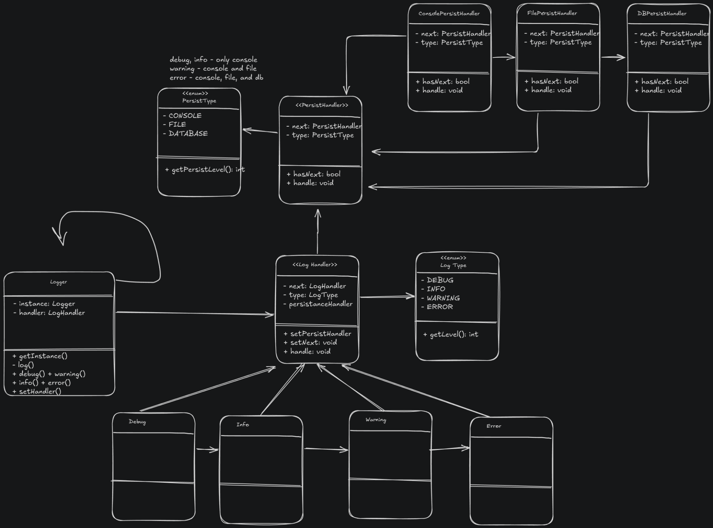
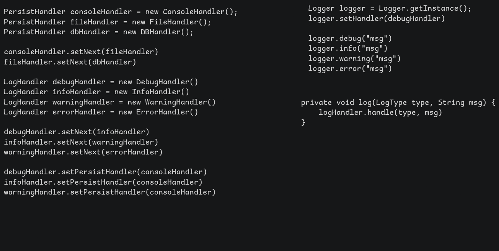

# Logging Framework

## Problem statement

Implement a logging framework, that provides a simple and flexible logging interface with extensibility.

## Usecase Flow

- access to a singleton Logger instance
- we can call Logger.* methods like debug(), info(), warning(), error()
- we can log the output either in console, file or in database - extensible
- each log type has a log level and a log format to print the log message
- log level decides if message is logged in file or console or database





```Java
```
