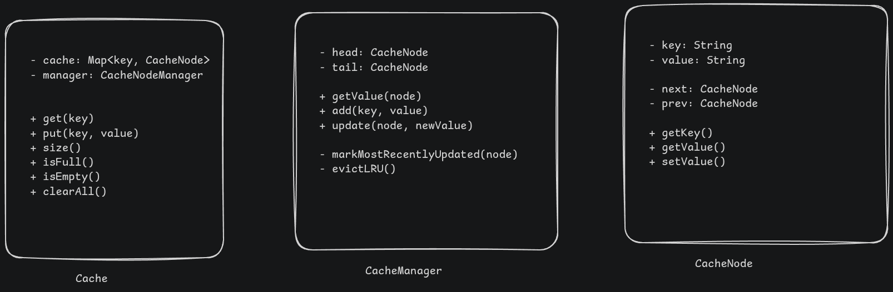

# LRU (Least Recently Used) Cache LLD

## Problem Statement

Design a cache system that stores key-value pairs with a fixed capacity. When the cache is full and a new item needs to be inserted, the least recently used item should be evicted.

## Usecase Flow

- Access to a cache instance - singleton instance
- we have methods like get(key), put(key, value) as main methods
- LRU as the name suggest -> Least Recently Used -> evict the least recently used when full
- when for a key, get(key) moves it as most recently used, similarly put(key, value) moves it unless cache is full and key not present - in this case - first evict LRU and then put as most recently used
- Cache is thread-safe

## Requirements

- Cache size is fixed and provided at the time of creation of the singleton instance
- get(key) - returns the value if present in the cache and marks the key as most recently used. If not present throws exception
- exist(key) - to prevent exception from get(key), user can use this method to check if key exists
- put(key, value) - inserts or updates the key-value pair. If key is already present, it updates the value and marks it as most recently used. If key is not present, it checks if cache is full, if yes evicts LRU and adds the new key-value pair as most recently used.
- in both get and put - most recent update has to happen
- for private method we need markMostRecent, evictLRU

## Design Patterns and Data structures

- Singleton pattern for the Cache class
- use ConcurrentHashMap to be thread-safe
- CacheNode class implements Doubly LinkedList which supports - update to most recent and eviction - as O(1)
- Cache class stores hashmap and head and tail of CacheNode



## Implementation

```java

class CacheDemo {
  public static void main(String[] args) {
    Cache cache = Cache.getInstance(5);

    System.out.println("Cache instantiated of size: " + cache.size());
    System.out.println("===============================");

    System.out.println("Putting (here, there) into cache");
    cache.put("here", "there");
    System.out.println("===============================");

    System.out.println("Putting (name, chaitanya) into cache");
    cache.put("name", "chaitanya");
    System.out.println("===============================");

    System.out.println("Getting (name) from cache: " + cache.get("name"));
    System.out.println("===============================");
    System.out.println("Getting (here) from cache: " + cache.get("here"));
    System.out.println("===============================");

    System.out.println("Putting (id, 25) into cache");
    cache.put("id", 25);
    System.out.println("===============================");

    System.out.println("Putting (email, chaitanya@) into cache");
    cache.put("email", "chaitanya@");
    System.out.println("===============================");

    System.out.println("Putting (phone, 1234567890) into cache");
    cache.put("phone", "1234567890");

    System.out.println("===============================");
    System.out.println("Getting (id) from cache: " + cache.get("id"));
    System.out.println("===============================");

    System.out.println("Putting (course, SWE) into cache - This will exceed capacity and evict LRU item - expected eviction is (name, chaitanya)");
    cache.put("course", "SWE");
    System.out.println("===============================");

    System.out.println("key (name) exists in cache? " + cache.exists("name"));
    System.out.println("===============================");
  }
}

class Cache {
  private static Cache instance;

  private CacheManager manager;
  private int size;

  private Cache(int size) {
    this.size = size;
    manager = new CacheManager(size);
  }

  // =============================================
  // Initialization methods
  private static synchronized void initialize(int size) {
    if (instance != null) {
      throw new IllegalStateException("Cache is already initialized");
    }

    instance = new Cache(size);
  }

  public static Cache getInstance() {
    if (instance == null) {
      throw new IllegalStateException("Cache needs to be initialized first.")
    }
    return instance;
  }

  // =============================================
  // Instance methods
  public int size() {
    return size;
  }

  public boolean isFull() {
    return cache.size() == size;
  }

  public boolean isEmpty() {
    return cache.isEmpty();
  }

  public void put(Object key, Object value) {
    manager.put(key, value);
  }

  public Object get(Object key) {
    return manager.get(key);
  }
}

// this will have one instance only because of singleton Cache class
class CacheManager {
  private Map<Object, CacheNode> cache;
  private CacheNode head;
  private CacheNode tail;
  private int size;

  private final ReadWriteLock lock = new ReentrantReadWriteLock();

  CacheManager(int size) {
    this.size = size;
    this.cache = new HashMap<>();
    head = new CacheNode();
    tail = new CacheNode();
    head.next = tail;
    tail.prev = head;
  }

  public void put(Object key, Object value) {
    lock.writeLock().lock();
    try {
      if (cache.containsKey(key)) {
        CacheNode cachedNode = cache.get(key);
        cachedNode.value = value;
        markMostRecent(cachedNode);
      } else {
        if (cache.size() == size) {
          evictLRU();
        }

        CacheNode newNode = new CacheNode(key, value);
        cache.put(key, newNode);
        addNode(newNode);
      }
    } finally {
      lock.writeLock().unlock();
    }
  }

  public Object get(Object key) {
    if (!exists(key)) {
      return null;
    }

    lock.writeLock().lock();
    try {
      CacheNode cachedNode = cache.get(key);
      markMostRecent(cachedNode);
      return cachedNode.value;
    } finally {
      lock.writeLock().unlock();
    }
  }

  public boolean exists(Object key) {
    lock.readLock().lock();
    try {
      return cache.containsKey(key);
    } finally {
      lock.readLock().unlock();
    }
  }

  // private helper methods
  private void markMostRecent(CacheNode node) {
    removeNode(node);
    addNode(node);
  }

  private void evictLRU() {
    CacheNode lruNode = tail.prev;
    removeNode(lruNode);
    cache.remove(lruNode.key);
  }

  private void addNode(CacheNode node) {
    node.next = head.next;
    node.prev = head;
    head.next.prev = node;
    head.next = node;
  }

  private void removeNode(CacheNode node) {
    node.prev.next = node.next;
    node.next.prev = node.prev;
  }
}

class CacheNode {
  Object key;
  Object value;

  CacheNode prev;
  CacheNode next;

  public CacheNode(Object key, Object value) {
    this.key = key;
    this.value = value;
  }

  public CacheNode() {
  }
}
```
