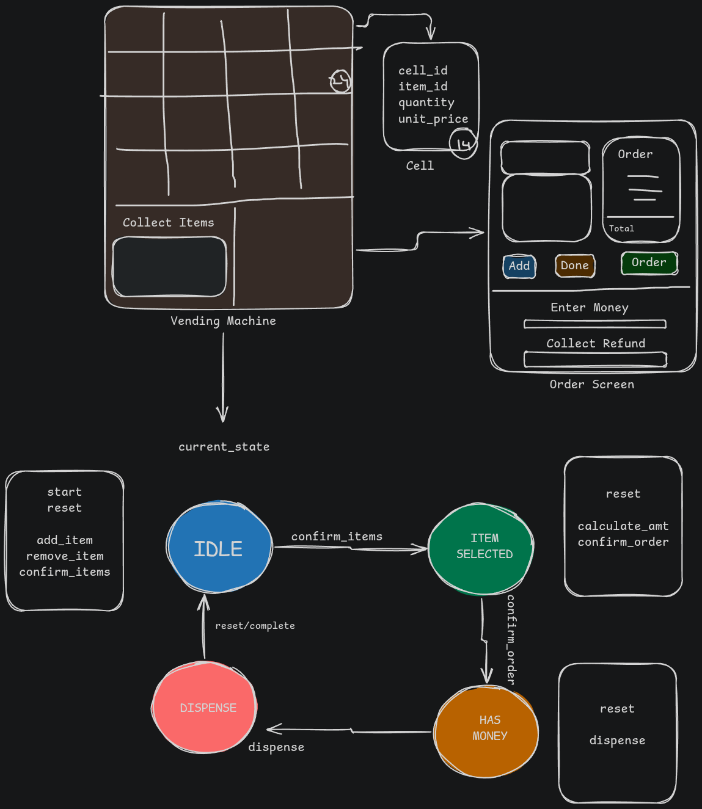
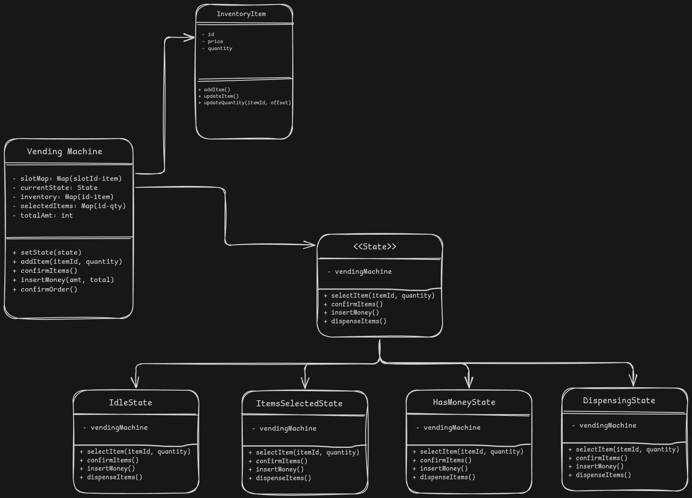

# Vending Machine LLD

## Problem Statement

Design and implement the low level design of a vending machine. The machines consists of rows and columns and each cell has a particular item in a given initial quantity. The machine takes a coin or a note and then dispenses the item(s), along with the change if any.

## Usecase Flow

- User comes to the machine
- User has option to enter the cell (row and column) for the item they want and quantity. After adding the cell and quantity, there are two options - Add or Done
- After pressing Done, user sees the total and asked to insert money in notes of denomination 10, 20, 50, 100
- User inserts money. System validates the notes and updates the total amount inserted
- System checks if the total amount is sufficient for the selected items

  - If yes, it dispenses the items, calculates change and returns it
  - If no, it returns the money inserted
- The checks involves:

  - before calculating final amount: check inventory for the item and quantity
  - after calculating final amount: check if the money entered is equal or more than the amount
  - and finally check if the change can be dispensed

## Requirements

- Vending machine with fixed rows and columns for items - fixed structure
- Each cell has information about - item_id, price, quantity, row and column
- Assuming that each cell is having item of only one type
- The vending machine should calculate and manage a few things
  - if it is empty - no items available
  - should manage orderService - add item, remove item, update quantity, check total price
  - should manage states the machine is in - very important

    - IDLE - no money and no order, item can be selected
    - ITEM_SELECTED - order has items selected and money can be inserted
    - HAS_MONEY - money inserted for an order, items can be dispensed
    - DISPENSING - there was an order and money inserted, and now dispensing order and change if any - no action

    IDLE -> ITEM_SELECTED -> HAS_MONEY -> DISPENSING -> IDLE

## Class Diagram





## Implementation

```java

class Driver {
  public static void main(String[] args) {
    VendingMachine vm = new VendingMachine();

    Item item1 = new Item("coke", 40, 4); // name, price, quantity
    Item item2 = new Item("lays", 30, 4); // name, price, quantity
    Item item3 = new Item("water", 20, 4); // name, price, quantity
    Item item4 = new Item("chips", 10, 4); // name, price, quantity
    Item item5 = new Item("juice", 50, 4); // name, price, quantity
    Item item6 = new Item("biscuit", 5, 4); // name, price, quantity

    List<Item> items = List.of(item1, item2, item3, item4, item5, item6);

    vm.setupInventory(items);

    System.out.println("Current State: " + vm.getState()); // Should be IDLE
    vm.selectItem(1, 1); // 40 rs
    vm.selectItem(3, 2); // 20*2 = 40 rs

    int totalAmt = vm.confirmItems(); // this locks the items selected, since we're doing multiple items
    System.out.println("Total Amount: " + totalAmt);
    System.out.println("Current State: " + vm.getState()); // Should be ITEM_SELECTED

    vm.insertMoney(100); // insert 100 rs, as can only add in denominations of 10, 20, 50, MONEY_AWAITED100
    // change is 20 rs,
    System.out.println("Current State: " + vm.getState()); // Should be HAS_MONEY

    int change = vm.confirmOrder(); // this dispenses the items and calculates the change
    System.out.println("Change: " + change);
    System.out.println("Current State: " + vm.getState()); // Should be DISPENSING

    System.out.println("Current State: " + vm.getState()); // Should be IDLE
  }
}

class VendingMachine {
  // instance variables
  State currentState;
  Map<Integer, Item> inventory;
  Map<Integer, Integer> selectedItems; // itemId -> quantity
  int totalAmount;
  int remainingChange;

  // constructor
  VendingMachine() {
    this.currentState = State.IDLE;
    this.inventory = new HashMap<>();
    this.selectedItems = new HashMap<>();
    this.totalAmount = 0;
    this.remainingChange = 0;
  }

  // methods
  public void setState(State state) {
    this.currentState = state;
  }

  public void setupInventory(List<Item> items) {
    for (int i = 0; i < items.size(); i++) {
      Item item = items.get(i);
      inventory.put(i+1, item); // mapping id to item
    }
  }

  public void addItem(itemId, quantity) {
    currentState.selectItem(itemId, quantity);
  }

  public int confirmItems() {
    currentState.confirmItems();
    return totalAmount;
  }

  public void insertMoney(amount) {
    currentState.insertMoney(amount);
  }

  public int confirmOrder() {
    currentState.confirmOrder();
    return remainingChange;
  }
}

class Item {
  String name;
  int price;
  int quantity;

  // constructor
  Item(String name, int price, int quantity) {
    this.name = name;
    this.price = price;
    this.quantity = quantity;
  }
}

abstract class State {
  VendingMachine vendingMachine;

  State(VendingMachine vendingMachine) {
    this.vendingMachine = vendingMachine;
  }

  public void selectItem(itemId, quantity) {}
  public void confirmItems() {}
  public void insertMoney(amount) {}
  public void confirmOrder() {}
}

class IdleState extends State {
  IdleState(VendingMachine vendingMachine) {
    super(vendingMachine);
  }

  public void selectItem(itemId, quantity) {
    // check inventory
    Item item = vendingMachine.getInventory().get(itemId);

    if (item == null) {
      System.out.println("Item " + itemId + " not found");
    } else if (item.getQuantity() < quantity) {
      System.out.println("Item " + itemId + " is out of stock");
    } else {
      System.out.println("Selected item " + item.name + " with quantity " + quantity);
      // update total price
      vendingMachine.totalAmount += item.price * quantity;
      vendingMachine.setSelectedItem(itemId, quantity);
    }
  }

  public void confirmItems() {
    System.out.println("Confirming items... current total price is " + vendingMachine.totalAmount);

    vendingMachine.setState(State.ITEM_SELECTED);
  }

  public void insertMoney(amount) {
    System.out.println("Select and confirm items before inserting money");
  }

  public void confirmOrder() {
    System.out.println("Select items and insert money before confirming order");
  }
}

class ItemSelectedState extends State {
  ItemSelectedState(VendingMachine vendingMachine) {
    super(vendingMachine);
  }

  public void selectItem(itemId, quantity) {
    System.out.println("Items selection locked. Waiting for payment.")
  }

  public void confirmItems() {
    System.out.println("Items already confirmed. Please insert money.")
  }

  public void insertMoney(amount) {
    // validate money
    int total = vendingMachine.totalAmount;

    if (amount < total) {
      System.out.println("Insufficient amount. Please insert correct in the denomination of 10, 20, 50, 100");
      return;
    }

    // money inserted, calculate change
    vendingMachine.remainingChange = total - amount;
    vendingMachine.setState(State.HAS_MONEY);
  }

  public void confirmOrder() {
    System.out.println("Please insert money to continue");
  }
}

class HasMoneyState extends State {
  HasMoneyState(VendingMachine vendingMachine) {
    super(vendingMachine);
  }

  public void selectItem(itemId, quantity) {
    System.out.println("Item selection not allowed. Please confirm order to get your items");
  }

  public void confirmItems() {
    System.out.println("Items already confirmed. Please confirm order");
  }

  public void insertMoney(amount) {
    System.out.println("Money already inserted. Please confirm order to get your items");
  }

  public void confirmOrder() {
    System.out.println("Items being dispensed");
    vendingMachine.setState(State.DISPENSING);
    // dispense items
    vendingMachine.dispenseItems();
    // return change if any
    vendingMachine.returnChange();
    // reset
    vendingMachine.reset();
  }
}

class DispensingState extends State {
  DispensingState(VendingMachine vendingMachine) {
    super(vendingMachine);
  }

  public void selectItem(itemId, quantity) {
    System.out.println("Items are being dispensed, please wait.");
  }

  public void confirmItems() {
    System.out.println("Items are being dispensed, please wait.");
  }

  public void insertMoney(amount) {
    System.out.println("Items are being dispensed, please wait.");
  }

  public void confirmOrder() {
    System.out.println("Items are being dispensed, please wait.");
  }
}
```
