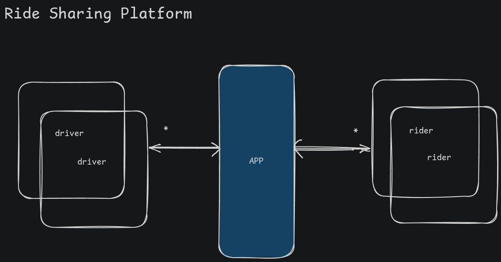

# Ride Sharing LLD

## Problem statement

Design and implement LLD of ride sharing platform like Uber/ola/rapido. Riders can request ride and drivers nearby are matched together, and they can accept/reject the ride.

## Usecase flow

- we have two types of users - rider and driver. (ideally different tables coz different attributes requirements)
- rider comes to the app
- rider search a location to go to. lets say pickup (x1, y1) and drop (x2, y2).
- platform shows the pricing - for keeping it simple, just one type of vehicle right now. Pricing can be calculated either like flat base fare + distance based or dynamic pricing based on demand.
- app will then send notification to the nearby drivers
- drivers can accept or reject or ignore the ride notification.
- if a driver accepts the ride, the notification is cancelled for other drivers and ride is confirmed.
- if in a range, drivers don't accept the ride, then the notifcation goes to a bigger radius with possibly higher price (but we won't do that, we'll just relay the same notifcation to a bigger subset, if that means that nearby driver gets it again, that is fine too)
- we'll generate a unique pin per user (one per user, not per ride) - 4 digit
- this pin is required to start the ride
- the ride is started and in progress, on reaching the destination, the driver has option to complete the ride, which shows the final fare, and ride is completed.

## Core Requirements

- We have rider and driver
- rider has a unique pin, name
- driver has name and a key value transient db like redis can store driver to their current location map
- ride request - pickup, drop, fare
- price can be calculated by a flat fee * distance in km. If there is more demand, we can charge surge pricing.
- ride request is then broadcast to all drivers sorted by proximity.
- the request can be accepted or ignored.
- driver choose to accept the request, then the notification is marked as resolved - ride acceptence should be safe from race conditions.
- we create a booking, with driver, rider, pickup, dropoff, fare, and status of PENDING_PICKUP
- Booking status -> PENDING_PICKUP, RIDE_CONFIRMED (based on pin), RIDE_IN_PROGRESS, RIDE_COMPLETED, RIDE_CANCELLED
- ride can only be cancelled, in case of PENDING_PICKUP, no other state provide that option.

## Nice to haves / out of scope

- dynamic pricing
- ratings
- tracking of location
- payments
- different vehicle types

## Assuming

- drivers are active, they are at the location specified in the KV map, and we can rely on that source assuming that it is up to date with drivers current location.
- service which calculates the distance in km between two locations.
- service which gives us sorted drivers according to geo location of the pickup.

## Design Patterns

- Strategy Patterns
  - PricingStrategy (static distance based, dynamic, surge)
  - MatchingStrategy (nearest, highest rated)
- Observer Pattern
  - Notification for the ride requests
  - ride request is the subject and drivers are observers subscribed to it
- State Pattern
  - for ride booking statuses - RIDE_PENDING_PICKUP, RIDE_IN_PROGRESS, RIDE_COMPLETED, RIDE_CANCELLED
- Builder Pattern (optional)
  - for ride request - pickup, dropoff, fare, etc can be built using builder pattern
- Simple factory (optional)
  - for creating strategies

## Class Diagrams

<svg version="1.1" xmlns="http://www.w3.org/2000/svg" viewBox="0 0 2441.4398527495387 1887.2009898368487" width="2441.4398527495387" height="1887.2009898368487"><!-- svg-source:excalidraw --><metadata></metadata><defs></defs><rect x="0" y="0" width="2441.4398527495387" height="1887.2009898368487" fill="#161718"></rect><g stroke-linecap="round" transform="translate(42 305.06809947139845) rotate(0 147.5 194)"><path d="M32 0 C97.36 -1.35, 162.94 3.02, 263 0 M32 0 C109.41 1.14, 189.9 1.05, 263 0 M263 0 C282.4 -3.82, 292.74 10.01, 295 32 M263 0 C280.94 -2.09, 293.48 13.98, 295 32 M295 32 C296.24 120.29, 294.93 205.08, 295 356 M295 32 C300.39 101.14, 300.42 168.57, 295 356 M295 356 C298.63 375.67, 281.08 390.28, 263 388 M295 356 C292.45 376.56, 284.83 386.07, 263 388 M263 388 C198.23 391.26, 132.09 388.12, 32 388 M263 388 C199.52 388.76, 137.65 387.78, 32 388 M32 388 C12.04 388.65, 2.72 377.41, 0 356 M32 388 C11.54 385.81, -4.52 377.73, 0 356 M0 356 C4.08 242.81, 6.29 127.24, 0 32 M0 356 C-1.17 260.12, 0.42 164.1, 0 32 M0 32 C-3.11 9.44, 14.57 1.91, 32 0 M0 32 C4.04 11.32, 9.59 -0.81, 32 0" stroke="#d3d3d3" stroke-width="2" fill="none"></path></g><g stroke-linecap="round" transform="translate(47 309.06809947139845) rotate(0 143.5 24)"><path d="M12 0 C110.99 1.32, 202.73 2.59, 275 0 M12 0 C78.34 -0.35, 144.2 -1.13, 275 0 M275 0 C281.1 -3.93, 287.35 6.01, 287 12 M275 0 C279.26 4.15, 287.71 4.48, 287 12 M287 12 C286.53 24.38, 282.8 30.22, 287 36 M287 12 C286.16 21.55, 287.73 28.96, 287 36 M287 36 C287.57 43.07, 282.29 46.31, 275 48 M287 36 C283.91 44.31, 282.56 50.46, 275 48 M275 48 C194.13 50.74, 115.68 49.42, 12 48 M275 48 C188.72 50.83, 98.88 49.21, 12 48 M12 48 C5.39 51.25, 3.21 41.66, 0 36 M12 48 C0 51.71, 0.14 47.07, 0 36 M0 36 C-0.23 27.69, -1.96 27.98, 0 12 M0 36 C0.22 30.14, -0.3 19.49, 0 12 M0 12 C-3.83 4.42, 2.22 0.16, 12 0 M0 12 C2.75 8.03, 7.93 2.95, 12 0" stroke="#d3d3d3" stroke-width="2" fill="none"></path></g><g transform="translate(48 527.0680994713985) rotate(0 147.5 -3)" stroke="none"><path fill="#d3d3d3" d="M -8.57,1.4 Q -8.57,1.4 -0.13,1.38 -0.27,1.37 -0.40,1.33 -0.53,1.29 -0.65,1.22 -0.77,1.16 -0.88,1.07 -0.98,0.98 -1.07,0.88 -1.16,0.77 -1.22,0.65 -1.29,0.53 -1.33,0.40 -1.37,0.27 -1.38,0.13 -1.4,-1.71 -1.38,-0.13 -1.37,-0.27 -1.33,-0.40 -1.29,-0.53 -1.22,-0.65 -1.16,-0.77 -1.07,-0.88 -0.98,-0.98 -0.88,-1.07 -0.77,-1.16 -0.65,-1.22 -0.53,-1.29 -0.40,-1.33 -0.27,-1.37 -0.13,-1.38 8.57,-1.4 0.75,-1.4 1.5,-1.4 3.12,-1.4 4.75,-1.4 7.56,-1.4 10.37,-1.4 14.28,-1.4 18.18,-1.4 25.14,-1.4 32.09,-1.4 48.07,-1.4 64.04,-1.4 79.28,-1.4 94.52,-1.4 107.39,-1.4 120.26,-1.4 128.68,-1.39 137.09,-1.39 148.30,-1.89 159.51,-2.39 168.87,-2.64 178.23,-2.89 186.66,-3.27 195.09,-3.64 202.56,-3.83 210.04,-4.02 216.76,-4.11 223.48,-4.21 229.09,-4.50 234.70,-4.80 238.51,-4.95 242.33,-5.10 244.74,-5.17 247.15,-5.25 248.86,-5.28 250.57,-5.32 252.17,-5.34 253.78,-5.36 254.83,-5.37 255.88,-5.38 256.84,-5.38 257.80,-5.38 259.04,-5.63 260.27,-5.88 261.71,-6.01 263.15,-6.14 265.11,-6.20 267.08,-6.27 268.55,-6.30 270.03,-6.33 271.02,-6.35 272.01,-6.36 272.62,-6.36 273.23,-6.35 273.80,-6.59 274.38,-6.84 275.30,-6.98 276.23,-7.13 277.43,-7.20 278.63,-7.27 280.23,-7.30 281.82,-7.33 283.36,-7.35 284.91,-7.36 286.18,-7.37 287.45,-7.38 288.84,-7.38 290.22,-7.39 291.16,-7.39 292.11,-7.39 292.97,-7.38 293.82,-7.37 293.96,-7.33 294.09,-7.29 294.21,-7.22 294.33,-7.16 294.44,-7.07 294.54,-6.98 294.63,-6.88 294.72,-6.77 294.78,-6.65 294.85,-6.53 294.89,-6.40 294.93,-6.27 294.94,-6.13 294.95,-5.99 294.94,-5.86 294.93,-5.72 294.89,-5.59 294.85,-5.46 294.78,-5.34 294.72,-5.22 294.63,-5.11 294.54,-5.00 294.44,-4.92 294.33,-4.83 294.21,-4.77 294.09,-4.70 293.96,-4.66 293.83,-4.62 293.69,-4.61 293.55,-4.59 293.42,-4.61 293.28,-4.62 293.15,-4.66 293.02,-4.70 292.90,-4.76 292.78,-4.83 292.67,-4.91 292.56,-5.00 292.48,-5.11 292.39,-5.21 292.32,-5.33 292.26,-5.46 292.22,-5.59 292.18,-5.72 292.17,-5.85 292.15,-5.99 292.17,-6.13 292.18,-6.26 292.22,-6.40 292.26,-6.53 292.32,-6.65 292.39,-6.77 292.47,-6.88 292.56,-6.98 292.67,-7.07 292.77,-7.16 292.89,-7.22 293.02,-7.29 293.15,-7.33 293.28,-7.37 293.41,-7.38 293.55,-7.39 293.69,-7.38 293.82,-7.37 293.96,-7.33 294.09,-7.29 294.21,-7.22 294.33,-7.16 294.44,-7.07 294.54,-6.98 294.63,-6.88 294.72,-6.77 294.78,-6.65 294.85,-6.53 294.89,-6.40 294.93,-6.27 294.94,-6.13 294.95,-5.99 294.94,-5.86 294.93,-5.72 294.89,-5.59 294.85,-5.46 294.78,-5.34 294.72,-5.22 294.63,-5.11 294.54,-5.00 294.44,-4.92 294.33,-4.83 294.21,-4.77 294.09,-4.70 293.96,-4.66 293.83,-4.62 293.69,-4.61 293.55,-4.59 292.83,-4.59 292.11,-4.59 291.17,-4.59 290.23,-4.59 288.85,-4.58 287.46,-4.58 286.20,-4.57 284.93,-4.56 283.39,-4.55 281.86,-4.53 280.30,-4.50 278.74,-4.47 277.63,-4.41 276.52,-4.35 275.82,-4.24 275.13,-4.14 274.46,-3.87 273.79,-3.61 272.92,-3.59 272.04,-3.56 271.06,-3.55 270.08,-3.53 268.62,-3.50 267.15,-3.47 265.24,-3.41 263.32,-3.35 261.99,-3.23 260.67,-3.10 259.38,-2.85 258.09,-2.59 256.99,-2.58 255.90,-2.58 254.86,-2.57 253.81,-2.56 252.21,-2.54 250.61,-2.52 248.92,-2.48 247.22,-2.45 244.83,-2.37 242.43,-2.30 238.63,-2.15 234.83,-2.00 229.20,-1.71 223.58,-1.41 216.84,-1.31 210.09,-1.22 202.64,-1.03 195.19,-0.85 186.76,-0.47 178.33,-0.10 168.97,0.14 159.61,0.39 148.38,0.89 137.16,1.39 128.71,1.39 120.26,1.4 107.39,1.4 94.52,1.4 79.28,1.4 64.04,1.4 48.07,1.4 32.09,1.4 25.14,1.4 18.18,1.4 14.28,1.4 10.37,1.4 7.56,1.4 4.75,1.4 3.12,1.4 1.5,1.4 0.75,1.4 -8.57,1.4 -8.57,1.4 L -8.57,1.4 Z"></path></g><g transform="translate(147 317.56809947139845) rotate(0 27.499961853027344 12.5)"><text x="0" y="17.5" font-family="Comic Shanns, monospace, Segoe UI Emoji" font-size="20px" fill="#d3d3d3" text-anchor="start" style="white-space: pre;" direction="ltr" dominant-baseline="alphabetic">Rider</text></g><g transform="translate(75 384.31809947139845) rotate(0 69.29953002929688 22.5)"><text x="0" y="15.75" font-family="Comic Shanns, monospace, Segoe UI Emoji" font-size="18px" fill="#d3d3d3" text-anchor="start" style="white-space: pre;" direction="ltr" dominant-baseline="alphabetic">- name: String</text><text x="0" y="38.25" font-family="Comic Shanns, monospace, Segoe UI Emoji" font-size="18px" fill="#d3d3d3" text-anchor="start" style="white-space: pre;" direction="ltr" dominant-baseline="alphabetic">- pin: int</text></g><g transform="translate(71 547.5680994713985) rotate(0 60.499916076660156 37.5)"><text x="0" y="17.5" font-family="Comic Shanns, monospace, Segoe UI Emoji" font-size="20px" fill="#d3d3d3" text-anchor="start" style="white-space: pre;" direction="ltr" dominant-baseline="alphabetic"></text><text x="0" y="42.5" font-family="Comic Shanns, monospace, Segoe UI Emoji" font-size="20px" fill="#d3d3d3" text-anchor="start" style="white-space: pre;" direction="ltr" dominant-baseline="alphabetic">+ getName()</text><text x="0" y="67.5" font-family="Comic Shanns, monospace, Segoe UI Emoji" font-size="20px" fill="#d3d3d3" text-anchor="start" style="white-space: pre;" direction="ltr" dominant-baseline="alphabetic">+ getPin()</text></g><g stroke-linecap="round" transform="translate(442.43985274953866 240) rotate(0 147.5 194)"><path d="M32 0 C109.87 -5.3, 186.08 0.69, 263 0 M32 0 C92.88 1.05, 152.56 -1.33, 263 0 M263 0 C285.4 -2.25, 296.47 9.13, 295 32 M263 0 C285.67 1.05, 294.6 14.37, 295 32 M295 32 C294.23 141.58, 292.98 247.74, 295 356 M295 32 C299.81 96.98, 299.75 163.71, 295 356 M295 356 C296.79 379.11, 287.61 391.92, 263 388 M295 356 C297.98 374.7, 287.11 387.35, 263 388 M263 388 C214.97 384.13, 159.78 383.64, 32 388 M263 388 C215.71 391.42, 167.54 391.44, 32 388 M32 388 C12.25 388.18, 2.57 377.9, 0 356 M32 388 C12.37 389.62, 2.63 378.49, 0 356 M0 356 C-4.78 267.11, -3.74 184.68, 0 32 M0 356 C-1.56 254.41, -0.1 152.8, 0 32 M0 32 C-0.67 14.4, 6.92 -0.01, 32 0 M0 32 C0.14 9.52, 13.35 -3.49, 32 0" stroke="#d3d3d3" stroke-width="2" fill="none"></path></g><g stroke-linecap="round" transform="translate(447.43985274953866 244) rotate(0 143.5 24)"><path d="M12 0 C105.96 6.47, 200.43 2.45, 275 0 M12 0 C91.32 -3.7, 169.16 -3.27, 275 0 M275 0 C284.47 -1.53, 288.16 4.91, 287 12 M275 0 C282.6 3.7, 288.67 2.21, 287 12 M287 12 C286.78 15.67, 283.24 28.55, 287 36 M287 12 C289.34 20.68, 288.36 27.57, 287 36 M287 36 C290.27 47.92, 285.59 45.71, 275 48 M287 36 C289.77 43.35, 279.32 47.88, 275 48 M275 48 C205.43 42.63, 135.72 48.03, 12 48 M275 48 C175.47 49.75, 78.79 49.33, 12 48 M12 48 C6.57 48.56, 1.48 45.41, 0 36 M12 48 C6.63 49.15, -1.46 48.35, 0 36 M0 36 C0.83 33.96, 0.57 25.66, 0 12 M0 36 C1.65 27.12, -0.19 23.12, 0 12 M0 12 C-3.75 3.99, 4.12 -0.99, 12 0 M0 12 C2.69 0.51, 6.81 -0.2, 12 0" stroke="#d3d3d3" stroke-width="2" fill="none"></path></g><g transform="translate(448.43985274953866 462) rotate(0 147.5 -3)" stroke="none"><path fill="#d3d3d3" d="M -8.57,1.4 Q -8.57,1.4 -0.13,1.38 -0.27,1.37 -0.40,1.33 -0.53,1.29 -0.65,1.22 -0.77,1.16 -0.88,1.07 -0.98,0.98 -1.07,0.88 -1.16,0.77 -1.22,0.65 -1.29,0.53 -1.33,0.40 -1.37,0.27 -1.38,0.13 -1.4,-1.71 -1.38,-0.13 -1.37,-0.27 -1.33,-0.40 -1.29,-0.53 -1.22,-0.65 -1.16,-0.77 -1.07,-0.88 -0.98,-0.98 -0.88,-1.07 -0.77,-1.16 -0.65,-1.22 -0.53,-1.29 -0.40,-1.33 -0.27,-1.37 -0.13,-1.38 8.57,-1.4 0.75,-1.4 1.5,-1.4 3.12,-1.4 4.75,-1.4 7.56,-1.4 10.37,-1.4 14.28,-1.4 18.18,-1.4 25.14,-1.4 32.09,-1.4 48.07,-1.4 64.04,-1.4 79.28,-1.4 94.52,-1.4 107.39,-1.4 120.26,-1.4 128.68,-1.39 137.09,-1.39 148.30,-1.89 159.51,-2.39 168.87,-2.64 178.23,-2.89 186.66,-3.27 195.09,-3.64 202.56,-3.83 210.04,-4.02 216.76,-4.11 223.48,-4.21 229.09,-4.50 234.70,-4.80 238.51,-4.95 242.33,-5.10 244.74,-5.17 247.15,-5.25 248.86,-5.28 250.57,-5.32 252.17,-5.34 253.78,-5.36 254.83,-5.37 255.88,-5.38 256.84,-5.38 257.80,-5.38 259.04,-5.63 260.27,-5.88 261.71,-6.01 263.15,-6.14 265.11,-6.20 267.08,-6.27 268.55,-6.30 270.03,-6.33 271.02,-6.35 272.01,-6.36 272.62,-6.36 273.23,-6.35 273.80,-6.59 274.38,-6.84 275.30,-6.98 276.23,-7.13 277.43,-7.20 278.63,-7.27 280.23,-7.30 281.82,-7.33 283.36,-7.35 284.91,-7.36 286.18,-7.37 287.45,-7.38 288.84,-7.38 290.22,-7.39 291.16,-7.39 292.11,-7.39 292.97,-7.38 293.82,-7.37 293.96,-7.33 294.09,-7.29 294.21,-7.22 294.33,-7.16 294.44,-7.07 294.54,-6.98 294.63,-6.88 294.72,-6.77 294.78,-6.65 294.85,-6.53 294.89,-6.40 294.93,-6.27 294.94,-6.13 294.95,-5.99 294.94,-5.86 294.93,-5.72 294.89,-5.59 294.85,-5.46 294.78,-5.34 294.72,-5.22 294.63,-5.11 294.54,-5.00 294.44,-4.92 294.33,-4.83 294.21,-4.77 294.09,-4.70 293.96,-4.66 293.83,-4.62 293.69,-4.61 293.55,-4.59 293.42,-4.61 293.28,-4.62 293.15,-4.66 293.02,-4.70 292.90,-4.76 292.78,-4.83 292.67,-4.91 292.56,-5.00 292.48,-5.11 292.39,-5.21 292.32,-5.33 292.26,-5.46 292.22,-5.59 292.18,-5.72 292.17,-5.85 292.15,-5.99 292.17,-6.13 292.18,-6.26 292.22,-6.40 292.26,-6.53 292.32,-6.65 292.39,-6.77 292.47,-6.88 292.56,-6.98 292.67,-7.07 292.77,-7.16 292.89,-7.22 293.02,-7.29 293.15,-7.33 293.28,-7.37 293.41,-7.38 293.55,-7.39 293.69,-7.38 293.82,-7.37 293.96,-7.33 294.09,-7.29 294.21,-7.22 294.33,-7.16 294.44,-7.07 294.54,-6.98 294.63,-6.88 294.72,-6.77 294.78,-6.65 294.85,-6.53 294.89,-6.40 294.93,-6.27 294.94,-6.13 294.95,-5.99 294.94,-5.86 294.93,-5.72 294.89,-5.59 294.85,-5.46 294.78,-5.34 294.72,-5.22 294.63,-5.11 294.54,-5.00 294.44,-4.92 294.33,-4.83 294.21,-4.77 294.09,-4.70 293.96,-4.66 293.83,-4.62 293.69,-4.61 293.55,-4.59 292.83,-4.59 292.11,-4.59 291.17,-4.59 290.23,-4.59 288.85,-4.58 287.46,-4.58 286.20,-4.57 284.93,-4.56 283.39,-4.55 281.86,-4.53 280.30,-4.50 278.74,-4.47 277.63,-4.41 276.52,-4.35 275.82,-4.24 275.13,-4.14 274.46,-3.87 273.79,-3.61 272.92,-3.59 272.04,-3.56 271.06,-3.55 270.08,-3.53 268.62,-3.50 267.15,-3.47 265.24,-3.41 263.32,-3.35 261.99,-3.23 260.67,-3.10 259.38,-2.85 258.09,-2.59 256.99,-2.58 255.90,-2.58 254.86,-2.57 253.81,-2.56 252.21,-2.54 250.61,-2.52 248.92,-2.48 247.22,-2.45 244.83,-2.37 242.43,-2.30 238.63,-2.15 234.83,-2.00 229.20,-1.71 223.58,-1.41 216.84,-1.31 210.09,-1.22 202.64,-1.03 195.19,-0.85 186.76,-0.47 178.33,-0.10 168.97,0.14 159.61,0.39 148.38,0.89 137.16,1.39 128.71,1.39 120.26,1.4 107.39,1.4 94.52,1.4 79.28,1.4 64.04,1.4 48.07,1.4 32.09,1.4 25.14,1.4 18.18,1.4 14.28,1.4 10.37,1.4 7.56,1.4 4.75,1.4 3.12,1.4 1.5,1.4 0.75,1.4 -8.57,1.4 -8.57,1.4 L -8.57,1.4 Z"></path></g><g transform="translate(524.4398527495387 255.5) rotate(0 60.499916076660156 12.5)"><text x="0" y="17.5" font-family="Comic Shanns, monospace, Segoe UI Emoji" font-size="20px" fill="#d3d3d3" text-anchor="start" style="white-space: pre;" direction="ltr" dominant-baseline="alphabetic">RideBooking</text></g><g transform="translate(452.43985274953866 311.25) rotate(0 128.69912719726562 45)"><text x="0" y="15.75" font-family="Comic Shanns, monospace, Segoe UI Emoji" font-size="18px" fill="#d3d3d3" text-anchor="start" style="white-space: pre;" direction="ltr" dominant-baseline="alphabetic">- rider: Rider</text><text x="0" y="38.25" font-family="Comic Shanns, monospace, Segoe UI Emoji" font-size="18px" fill="#d3d3d3" text-anchor="start" style="white-space: pre;" direction="ltr" dominant-baseline="alphabetic">- driver: Driver</text><text x="0" y="60.75" font-family="Comic Shanns, monospace, Segoe UI Emoji" font-size="18px" fill="#d3d3d3" text-anchor="start" style="white-space: pre;" direction="ltr" dominant-baseline="alphabetic">- state: BookingState</text><text x="0" y="83.25" font-family="Comic Shanns, monospace, Segoe UI Emoji" font-size="18px" fill="#d3d3d3" text-anchor="start" style="white-space: pre;" direction="ltr" dominant-baseline="alphabetic">- rideRequest: RideRequest</text></g><g transform="translate(452.43985274953866 472) rotate(0 70.400146484375 30)"><text x="0" y="14" font-family="Comic Shanns, monospace, Segoe UI Emoji" font-size="16px" fill="#d3d3d3" text-anchor="start" style="white-space: pre;" direction="ltr" dominant-baseline="alphabetic">+ startRide(pin)</text><text x="0" y="34" font-family="Comic Shanns, monospace, Segoe UI Emoji" font-size="16px" fill="#d3d3d3" text-anchor="start" style="white-space: pre;" direction="ltr" dominant-baseline="alphabetic">+ completeRide()</text><text x="0" y="54" font-family="Comic Shanns, monospace, Segoe UI Emoji" font-size="16px" fill="#d3d3d3" text-anchor="start" style="white-space: pre;" direction="ltr" dominant-baseline="alphabetic">+ cancelRide()</text></g><g stroke-linecap="round" transform="translate(1211.4398527495387 10) rotate(0 147.5 194)"><path d="M32 0 C80.71 1.58, 130.89 1.42, 263 0 M32 0 C124.27 -3.88, 214.46 -2.23, 263 0 M263 0 C285.12 -0.73, 297.66 13.33, 295 32 M263 0 C280.4 2.56, 294.81 11.21, 295 32 M295 32 C294.04 142.93, 293.17 249.27, 295 356 M295 32 C293.71 124.98, 295.48 216.48, 295 356 M295 356 C292 374.77, 284.26 391.59, 263 388 M295 356 C292.18 379.4, 283.38 385.53, 263 388 M263 388 C191.9 384, 119.72 386.09, 32 388 M263 388 C173.44 391.27, 83.01 392.05, 32 388 M32 388 C8.4 386.37, -2.66 376.93, 0 356 M32 388 C7.73 388.03, 1.78 378, 0 356 M0 356 C-6.72 247.26, -3.79 136, 0 32 M0 356 C-0.47 252.21, -1.16 148.55, 0 32 M0 32 C0.45 14.52, 6.91 1.39, 32 0 M0 32 C-3.57 14.28, 8.63 1.22, 32 0" stroke="#d3d3d3" stroke-width="2" fill="none"></path></g><g stroke-linecap="round" transform="translate(1213.4398527495387 17) rotate(0 143.5 24)"><path d="M12 0 C88.24 -0.43, 164.38 1.83, 275 0 M12 0 C109.38 3.47, 205.31 2.81, 275 0 M275 0 C285.66 2.67, 283.58 6.22, 287 12 M275 0 C282.81 0.54, 288.56 1.97, 287 12 M287 12 C287.4 18.64, 286.55 22.35, 287 36 M287 12 C287.82 18.08, 285.16 22.3, 287 36 M287 36 C286.93 47.59, 280.54 49.8, 275 48 M287 36 C286.05 41.53, 283.21 51.97, 275 48 M275 48 C212.86 47.49, 158.49 45.95, 12 48 M275 48 C174.94 49.05, 73.68 47.58, 12 48 M12 48 C1.34 47.6, -2.56 44.03, 0 36 M12 48 C5.78 48.67, 1.82 48.28, 0 36 M0 36 C1 30.59, 1.18 25.46, 0 12 M0 36 C-1.24 25.92, 0.3 20.87, 0 12 M0 12 C-3.76 5.39, 0.89 3.14, 12 0 M0 12 C-2.04 5.22, 2.66 -4.33, 12 0" stroke="#d3d3d3" stroke-width="2" fill="none"></path></g><g transform="translate(1214.4398527495387 235) rotate(0 147.5 -3)" stroke="none"><path fill="#d3d3d3" d="M -8.57,1.4 Q -8.57,1.4 -0.13,1.38 -0.27,1.37 -0.40,1.33 -0.53,1.29 -0.65,1.22 -0.77,1.16 -0.88,1.07 -0.98,0.98 -1.07,0.88 -1.16,0.77 -1.22,0.65 -1.29,0.53 -1.33,0.40 -1.37,0.27 -1.38,0.13 -1.4,-1.71 -1.38,-0.13 -1.37,-0.27 -1.33,-0.40 -1.29,-0.53 -1.22,-0.65 -1.16,-0.77 -1.07,-0.88 -0.98,-0.98 -0.88,-1.07 -0.77,-1.16 -0.65,-1.22 -0.53,-1.29 -0.40,-1.33 -0.27,-1.37 -0.13,-1.38 8.57,-1.4 0.75,-1.4 1.5,-1.4 3.12,-1.4 4.75,-1.4 7.56,-1.4 10.37,-1.4 14.28,-1.4 18.18,-1.4 25.14,-1.4 32.09,-1.4 48.07,-1.4 64.04,-1.4 79.28,-1.4 94.52,-1.4 107.39,-1.4 120.26,-1.4 128.68,-1.39 137.09,-1.39 148.30,-1.89 159.51,-2.39 168.87,-2.64 178.23,-2.89 186.66,-3.27 195.09,-3.64 202.56,-3.83 210.04,-4.02 216.76,-4.11 223.48,-4.21 229.09,-4.50 234.70,-4.80 238.51,-4.95 242.33,-5.10 244.74,-5.17 247.15,-5.25 248.86,-5.28 250.57,-5.32 252.17,-5.34 253.78,-5.36 254.83,-5.37 255.88,-5.38 256.84,-5.38 257.80,-5.38 259.04,-5.63 260.27,-5.88 261.71,-6.01 263.15,-6.14 265.11,-6.20 267.08,-6.27 268.55,-6.30 270.03,-6.33 271.02,-6.35 272.01,-6.36 272.62,-6.36 273.23,-6.35 273.80,-6.59 274.38,-6.84 275.30,-6.98 276.23,-7.13 277.43,-7.20 278.63,-7.27 280.23,-7.30 281.82,-7.33 283.36,-7.35 284.91,-7.36 286.18,-7.37 287.45,-7.38 288.84,-7.38 290.22,-7.39 291.16,-7.39 292.11,-7.39 292.97,-7.38 293.82,-7.37 293.96,-7.33 294.09,-7.29 294.21,-7.22 294.33,-7.16 294.44,-7.07 294.54,-6.98 294.63,-6.88 294.72,-6.77 294.78,-6.65 294.85,-6.53 294.89,-6.40 294.93,-6.27 294.94,-6.13 294.95,-5.99 294.94,-5.86 294.93,-5.72 294.89,-5.59 294.85,-5.46 294.78,-5.34 294.72,-5.22 294.63,-5.11 294.54,-5.00 294.44,-4.92 294.33,-4.83 294.21,-4.77 294.09,-4.70 293.96,-4.66 293.83,-4.62 293.69,-4.61 293.55,-4.59 293.42,-4.61 293.28,-4.62 293.15,-4.66 293.02,-4.70 292.90,-4.76 292.78,-4.83 292.67,-4.91 292.56,-5.00 292.48,-5.11 292.39,-5.21 292.32,-5.33 292.26,-5.46 292.22,-5.59 292.18,-5.72 292.17,-5.85 292.15,-5.99 292.17,-6.13 292.18,-6.26 292.22,-6.40 292.26,-6.53 292.32,-6.65 292.39,-6.77 292.47,-6.88 292.56,-6.98 292.67,-7.07 292.77,-7.16 292.89,-7.22 293.02,-7.29 293.15,-7.33 293.28,-7.37 293.41,-7.38 293.55,-7.39 293.69,-7.38 293.82,-7.37 293.96,-7.33 294.09,-7.29 294.21,-7.22 294.33,-7.16 294.44,-7.07 294.54,-6.98 294.63,-6.88 294.72,-6.77 294.78,-6.65 294.85,-6.53 294.89,-6.40 294.93,-6.27 294.94,-6.13 294.95,-5.99 294.94,-5.86 294.93,-5.72 294.89,-5.59 294.85,-5.46 294.78,-5.34 294.72,-5.22 294.63,-5.11 294.54,-5.00 294.44,-4.92 294.33,-4.83 294.21,-4.77 294.09,-4.70 293.96,-4.66 293.83,-4.62 293.69,-4.61 293.55,-4.59 292.83,-4.59 292.11,-4.59 291.17,-4.59 290.23,-4.59 288.85,-4.58 287.46,-4.58 286.20,-4.57 284.93,-4.56 283.39,-4.55 281.86,-4.53 280.30,-4.50 278.74,-4.47 277.63,-4.41 276.52,-4.35 275.82,-4.24 275.13,-4.14 274.46,-3.87 273.79,-3.61 272.92,-3.59 272.04,-3.56 271.06,-3.55 270.08,-3.53 268.62,-3.50 267.15,-3.47 265.24,-3.41 263.32,-3.35 261.99,-3.23 260.67,-3.10 259.38,-2.85 258.09,-2.59 256.99,-2.58 255.90,-2.58 254.86,-2.57 253.81,-2.56 252.21,-2.54 250.61,-2.52 248.92,-2.48 247.22,-2.45 244.83,-2.37 242.43,-2.30 238.63,-2.15 234.83,-2.00 229.20,-1.71 223.58,-1.41 216.84,-1.31 210.09,-1.22 202.64,-1.03 195.19,-0.85 186.76,-0.47 178.33,-0.10 168.97,0.14 159.61,0.39 148.38,0.89 137.16,1.39 128.71,1.39 120.26,1.4 107.39,1.4 94.52,1.4 79.28,1.4 64.04,1.4 48.07,1.4 32.09,1.4 25.14,1.4 18.18,1.4 14.28,1.4 10.37,1.4 7.56,1.4 4.75,1.4 3.12,1.4 1.5,1.4 0.75,1.4 -8.57,1.4 -8.57,1.4 L -8.57,1.4 Z"></path></g><g transform="translate(1264.4398527495387 26.5) rotate(0 87.9998779296875 12.5)"><text x="0" y="17.5" font-family="Comic Shanns, monospace, Segoe UI Emoji" font-size="20px" fill="#d3d3d3" text-anchor="start" style="white-space: pre;" direction="ltr" dominant-baseline="alphabetic"><<BookingState>></text></g><g transform="translate(1225.4398527495387 252.5) rotate(0 87.9998779296875 37.5)"><text x="0" y="17.5" font-family="Comic Shanns, monospace, Segoe UI Emoji" font-size="20px" fill="#d3d3d3" text-anchor="start" style="white-space: pre;" direction="ltr" dominant-baseline="alphabetic">+ startRide(pin)</text><text x="0" y="42.5" font-family="Comic Shanns, monospace, Segoe UI Emoji" font-size="20px" fill="#d3d3d3" text-anchor="start" style="white-space: pre;" direction="ltr" dominant-baseline="alphabetic">+ completeRide()</text><text x="0" y="67.5" font-family="Comic Shanns, monospace, Segoe UI Emoji" font-size="20px" fill="#d3d3d3" text-anchor="start" style="white-space: pre;" direction="ltr" dominant-baseline="alphabetic">+ cancelRide()</text></g><g transform="translate(1238.4676305273165 89.64393939393631) rotate(0 49.49993133544922 12.5)"><text x="0" y="17.5" font-family="Comic Shanns, monospace, Segoe UI Emoji" font-size="20px" fill="#d3d3d3" text-anchor="start" style="white-space: pre;" direction="ltr" dominant-baseline="alphabetic">- context</text></g><g stroke-linecap="round" transform="translate(927.4398527495387 500) rotate(0 147.5 194)"><path d="M32 0 C87.32 0.16, 144.23 -1.67, 263 0 M32 0 C83.51 -2.99, 136.52 -1.5, 263 0 M263 0 C285.54 3.01, 291.26 14.47, 295 32 M263 0 C287.48 -1.87, 291.56 14.49, 295 32 M295 32 C290.78 116.75, 291.49 207.85, 295 356 M295 32 C291.76 149.21, 290.89 268.99, 295 356 M295 356 C295.93 375.17, 285.29 387.35, 263 388 M295 356 C299.12 380.25, 288.27 387.35, 263 388 M263 388 C203.55 384.73, 144.92 388.5, 32 388 M263 388 C172.93 391.04, 86.32 390.99, 32 388 M32 388 C13.87 384.1, -2.39 374.87, 0 356 M32 388 C13.01 388.98, -3.17 381.52, 0 356 M0 356 C3.4 237.15, 0.27 119.2, 0 32 M0 356 C5.18 236.03, 5.03 116.02, 0 32 M0 32 C-3.16 11.29, 9.62 1.44, 32 0 M0 32 C-3.01 6.12, 14.02 -2.66, 32 0" stroke="#d3d3d3" stroke-width="2" fill="none"></path></g><g stroke-linecap="round" transform="translate(929.4398527495387 507) rotate(0 143.5 24)"><path d="M12 0 C111.25 -2.67, 208.63 -2.63, 275 0 M12 0 C107.42 2.36, 202.05 2.74, 275 0 M275 0 C279.26 3.8, 289.74 2.38, 287 12 M275 0 C279.56 3.83, 285.54 0.58, 287 12 M287 12 C286.61 20.69, 289.41 20.97, 287 36 M287 12 C285.37 20.62, 287.39 25.15, 287 36 M287 36 C287.96 43.35, 286.58 50.54, 275 48 M287 36 C290.94 43.35, 280.75 50.53, 275 48 M275 48 C202.28 47.07, 136.12 47.06, 12 48 M275 48 C172.14 45.82, 69.2 44.91, 12 48 M12 48 C1.61 45.53, 2.04 44.86, 0 36 M12 48 C0.83 52.19, 2.94 41.68, 0 36 M0 36 C-3.08 25.72, 2.66 15.01, 0 12 M0 36 C1.3 32.06, -2.06 26.32, 0 12 M0 12 C-1.05 5.44, 1.38 -3.95, 12 0 M0 12 C3.35 1.34, 4.57 0.57, 12 0" stroke="#d3d3d3" stroke-width="2" fill="none"></path></g><g transform="translate(930.4398527495387 725) rotate(0 147.5 -3)" stroke="none"><path fill="#d3d3d3" d="M -8.57,1.4 Q -8.57,1.4 -0.13,1.38 -0.27,1.37 -0.40,1.33 -0.53,1.29 -0.65,1.22 -0.77,1.16 -0.88,1.07 -0.98,0.98 -1.07,0.88 -1.16,0.77 -1.22,0.65 -1.29,0.53 -1.33,0.40 -1.37,0.27 -1.38,0.13 -1.4,-1.71 -1.38,-0.13 -1.37,-0.27 -1.33,-0.40 -1.29,-0.53 -1.22,-0.65 -1.16,-0.77 -1.07,-0.88 -0.98,-0.98 -0.88,-1.07 -0.77,-1.16 -0.65,-1.22 -0.53,-1.29 -0.40,-1.33 -0.27,-1.37 -0.13,-1.38 8.57,-1.4 0.75,-1.4 1.5,-1.4 3.12,-1.4 4.75,-1.4 7.56,-1.4 10.37,-1.4 14.28,-1.4 18.18,-1.4 25.14,-1.4 32.09,-1.4 48.07,-1.4 64.04,-1.4 79.28,-1.4 94.52,-1.4 107.39,-1.4 120.26,-1.4 128.68,-1.39 137.09,-1.39 148.30,-1.89 159.51,-2.39 168.87,-2.64 178.23,-2.89 186.66,-3.27 195.09,-3.64 202.56,-3.83 210.04,-4.02 216.76,-4.11 223.48,-4.21 229.09,-4.50 234.70,-4.80 238.51,-4.95 242.33,-5.10 244.74,-5.17 247.15,-5.25 248.86,-5.28 250.57,-5.32 252.17,-5.34 253.78,-5.36 254.83,-5.37 255.88,-5.38 256.84,-5.38 257.80,-5.38 259.04,-5.63 260.27,-5.88 261.71,-6.01 263.15,-6.14 265.11,-6.20 267.08,-6.27 268.55,-6.30 270.03,-6.33 271.02,-6.35 272.01,-6.36 272.62,-6.36 273.23,-6.35 273.80,-6.59 274.38,-6.84 275.30,-6.98 276.23,-7.13 277.43,-7.20 278.63,-7.27 280.23,-7.30 281.82,-7.33 283.36,-7.35 284.91,-7.36 286.18,-7.37 287.45,-7.38 288.84,-7.38 290.22,-7.39 291.16,-7.39 292.11,-7.39 292.97,-7.38 293.82,-7.37 293.96,-7.33 294.09,-7.29 294.21,-7.22 294.33,-7.16 294.44,-7.07 294.54,-6.98 294.63,-6.88 294.72,-6.77 294.78,-6.65 294.85,-6.53 294.89,-6.40 294.93,-6.27 294.94,-6.13 294.95,-5.99 294.94,-5.86 294.93,-5.72 294.89,-5.59 294.85,-5.46 294.78,-5.34 294.72,-5.22 294.63,-5.11 294.54,-5.00 294.44,-4.92 294.33,-4.83 294.21,-4.77 294.09,-4.70 293.96,-4.66 293.83,-4.62 293.69,-4.61 293.55,-4.59 293.42,-4.61 293.28,-4.62 293.15,-4.66 293.02,-4.70 292.90,-4.76 292.78,-4.83 292.67,-4.91 292.56,-5.00 292.48,-5.11 292.39,-5.21 292.32,-5.33 292.26,-5.46 292.22,-5.59 292.18,-5.72 292.17,-5.85 292.15,-5.99 292.17,-6.13 292.18,-6.26 292.22,-6.40 292.26,-6.53 292.32,-6.65 292.39,-6.77 292.47,-6.88 292.56,-6.98 292.67,-7.07 292.77,-7.16 292.89,-7.22 293.02,-7.29 293.15,-7.33 293.28,-7.37 293.41,-7.38 293.55,-7.39 293.69,-7.38 293.82,-7.37 293.96,-7.33 294.09,-7.29 294.21,-7.22 294.33,-7.16 294.44,-7.07 294.54,-6.98 294.63,-6.88 294.72,-6.77 294.78,-6.65 294.85,-6.53 294.89,-6.40 294.93,-6.27 294.94,-6.13 294.95,-5.99 294.94,-5.86 294.93,-5.72 294.89,-5.59 294.85,-5.46 294.78,-5.34 294.72,-5.22 294.63,-5.11 294.54,-5.00 294.44,-4.92 294.33,-4.83 294.21,-4.77 294.09,-4.70 293.96,-4.66 293.83,-4.62 293.69,-4.61 293.55,-4.59 292.83,-4.59 292.11,-4.59 291.17,-4.59 290.23,-4.59 288.85,-4.58 287.46,-4.58 286.20,-4.57 284.93,-4.56 283.39,-4.55 281.86,-4.53 280.30,-4.50 278.74,-4.47 277.63,-4.41 276.52,-4.35 275.82,-4.24 275.13,-4.14 274.46,-3.87 273.79,-3.61 272.92,-3.59 272.04,-3.56 271.06,-3.55 270.08,-3.53 268.62,-3.50 267.15,-3.47 265.24,-3.41 263.32,-3.35 261.99,-3.23 260.67,-3.10 259.38,-2.85 258.09,-2.59 256.99,-2.58 255.90,-2.58 254.86,-2.57 253.81,-2.56 252.21,-2.54 250.61,-2.52 248.92,-2.48 247.22,-2.45 244.83,-2.37 242.43,-2.30 238.63,-2.15 234.83,-2.00 229.20,-1.71 223.58,-1.41 216.84,-1.31 210.09,-1.22 202.64,-1.03 195.19,-0.85 186.76,-0.47 178.33,-0.10 168.97,0.14 159.61,0.39 148.38,0.89 137.16,1.39 128.71,1.39 120.26,1.4 107.39,1.4 94.52,1.4 79.28,1.4 64.04,1.4 48.07,1.4 32.09,1.4 25.14,1.4 18.18,1.4 14.28,1.4 10.37,1.4 7.56,1.4 4.75,1.4 3.12,1.4 1.5,1.4 0.75,1.4 -8.57,1.4 -8.57,1.4 L -8.57,1.4 Z"></path></g><g transform="translate(980.4398527495387 516.5) rotate(0 104.4998550415039 12.5)"><text x="0" y="17.5" font-family="Comic Shanns, monospace, Segoe UI Emoji" font-size="20px" fill="#d3d3d3" text-anchor="start" style="white-space: pre;" direction="ltr" dominant-baseline="alphabetic">PendingBookingState</text></g><g transform="translate(941.4398527495387 742.5) rotate(0 87.9998779296875 37.5)"><text x="0" y="17.5" font-family="Comic Shanns, monospace, Segoe UI Emoji" font-size="20px" fill="#d3d3d3" text-anchor="start" style="white-space: pre;" direction="ltr" dominant-baseline="alphabetic">+ startRide(pin)</text><text x="0" y="42.5" font-family="Comic Shanns, monospace, Segoe UI Emoji" font-size="20px" fill="#d3d3d3" text-anchor="start" style="white-space: pre;" direction="ltr" dominant-baseline="alphabetic">+ completeRide()</text><text x="0" y="67.5" font-family="Comic Shanns, monospace, Segoe UI Emoji" font-size="20px" fill="#d3d3d3" text-anchor="start" style="white-space: pre;" direction="ltr" dominant-baseline="alphabetic">+ cancelRide()</text></g><g transform="translate(954.4676305273165 579.6439393939363) rotate(0 49.49993133544922 12.5)"><text x="0" y="17.5" font-family="Comic Shanns, monospace, Segoe UI Emoji" font-size="20px" fill="#d3d3d3" text-anchor="start" style="white-space: pre;" direction="ltr" dominant-baseline="alphabetic">- context</text></g><g stroke-linecap="round" transform="translate(1306.4398527495387 490) rotate(0 147.5 194)"><path d="M32 0 C88.22 -4.34, 139.3 -0.79, 263 0 M32 0 C111.8 -2.68, 189.11 -2.94, 263 0 M263 0 C283.43 0.49, 296.72 7.84, 295 32 M263 0 C284.78 0.53, 294.53 11.59, 295 32 M295 32 C296.78 154.43, 296.61 276.33, 295 356 M295 32 C295.91 146.13, 295.61 259.84, 295 356 M295 356 C291.84 377.7, 286.48 389.88, 263 388 M295 356 C290.44 375.62, 281.19 388.18, 263 388 M263 388 C194.72 384.23, 129.19 383.85, 32 388 M263 388 C184.66 388.62, 105.53 388.77, 32 388 M32 388 C14.2 391.23, -3.95 376.97, 0 356 M32 388 C8.31 388, 2.45 377.06, 0 356 M0 356 C1.09 291.38, -2 226.39, 0 32 M0 356 C-3.87 228.83, -2.31 98.59, 0 32 M0 32 C-1.63 14.16, 9.21 -2.86, 32 0 M0 32 C4.34 9.83, 11.81 1.14, 32 0" stroke="#d3d3d3" stroke-width="2" fill="none"></path></g><g stroke-linecap="round" transform="translate(1308.4398527495387 497) rotate(0 143.5 24)"><path d="M12 0 C98.98 4.12, 193.06 2.83, 275 0 M12 0 C106.75 0.29, 200.81 1.05, 275 0 M275 0 C284.72 -2.82, 287.39 4.46, 287 12 M275 0 C282.53 0.92, 290.59 6.83, 287 12 M287 12 C285.16 16.48, 288.87 22.81, 287 36 M287 12 C287.97 17.55, 285.69 22.17, 287 36 M287 36 C289.14 45.88, 279.03 46.51, 275 48 M287 36 C283.86 44.18, 282.45 49, 275 48 M275 48 C206.93 43.18, 141.56 44.66, 12 48 M275 48 C200.01 51.59, 123.91 51.79, 12 48 M12 48 C0.05 47.63, -2.05 44, 0 36 M12 48 C6.45 47.73, -4.56 45.04, 0 36 M0 36 C-1.78 29.27, 3.46 24.19, 0 12 M0 36 C1.92 28.43, -0.71 25.62, 0 12 M0 12 C-1.46 1.14, 7.78 -0.73, 12 0 M0 12 C1.14 5.14, 7.74 2.69, 12 0" stroke="#d3d3d3" stroke-width="2" fill="none"></path></g><g transform="translate(1309.4398527495387 715) rotate(0 147.5 -3)" stroke="none"><path fill="#d3d3d3" d="M -8.57,1.4 Q -8.57,1.4 -0.13,1.38 -0.27,1.37 -0.40,1.33 -0.53,1.29 -0.65,1.22 -0.77,1.16 -0.88,1.07 -0.98,0.98 -1.07,0.88 -1.16,0.77 -1.22,0.65 -1.29,0.53 -1.33,0.40 -1.37,0.27 -1.38,0.13 -1.4,-1.71 -1.38,-0.13 -1.37,-0.27 -1.33,-0.40 -1.29,-0.53 -1.22,-0.65 -1.16,-0.77 -1.07,-0.88 -0.98,-0.98 -0.88,-1.07 -0.77,-1.16 -0.65,-1.22 -0.53,-1.29 -0.40,-1.33 -0.27,-1.37 -0.13,-1.38 8.57,-1.4 0.75,-1.4 1.5,-1.4 3.12,-1.4 4.75,-1.4 7.56,-1.4 10.37,-1.4 14.28,-1.4 18.18,-1.4 25.14,-1.4 32.09,-1.4 48.07,-1.4 64.04,-1.4 79.28,-1.4 94.52,-1.4 107.39,-1.4 120.26,-1.4 128.68,-1.39 137.09,-1.39 148.30,-1.89 159.51,-2.39 168.87,-2.64 178.23,-2.89 186.66,-3.27 195.09,-3.64 202.56,-3.83 210.04,-4.02 216.76,-4.11 223.48,-4.21 229.09,-4.50 234.70,-4.80 238.51,-4.95 242.33,-5.10 244.74,-5.17 247.15,-5.25 248.86,-5.28 250.57,-5.32 252.17,-5.34 253.78,-5.36 254.83,-5.37 255.88,-5.38 256.84,-5.38 257.80,-5.38 259.04,-5.63 260.27,-5.88 261.71,-6.01 263.15,-6.14 265.11,-6.20 267.08,-6.27 268.55,-6.30 270.03,-6.33 271.02,-6.35 272.01,-6.36 272.62,-6.36 273.23,-6.35 273.80,-6.59 274.38,-6.84 275.30,-6.98 276.23,-7.13 277.43,-7.20 278.63,-7.27 280.23,-7.30 281.82,-7.33 283.36,-7.35 284.91,-7.36 286.18,-7.37 287.45,-7.38 288.84,-7.38 290.22,-7.39 291.16,-7.39 292.11,-7.39 292.97,-7.38 293.82,-7.37 293.96,-7.33 294.09,-7.29 294.21,-7.22 294.33,-7.16 294.44,-7.07 294.54,-6.98 294.63,-6.88 294.72,-6.77 294.78,-6.65 294.85,-6.53 294.89,-6.40 294.93,-6.27 294.94,-6.13 294.95,-5.99 294.94,-5.86 294.93,-5.72 294.89,-5.59 294.85,-5.46 294.78,-5.34 294.72,-5.22 294.63,-5.11 294.54,-5.00 294.44,-4.92 294.33,-4.83 294.21,-4.77 294.09,-4.70 293.96,-4.66 293.83,-4.62 293.69,-4.61 293.55,-4.59 293.42,-4.61 293.28,-4.62 293.15,-4.66 293.02,-4.70 292.90,-4.76 292.78,-4.83 292.67,-4.91 292.56,-5.00 292.48,-5.11 292.39,-5.21 292.32,-5.33 292.26,-5.46 292.22,-5.59 292.18,-5.72 292.17,-5.85 292.15,-5.99 292.17,-6.13 292.18,-6.26 292.22,-6.40 292.26,-6.53 292.32,-6.65 292.39,-6.77 292.47,-6.88 292.56,-6.98 292.67,-7.07 292.77,-7.16 292.89,-7.22 293.02,-7.29 293.15,-7.33 293.28,-7.37 293.41,-7.38 293.55,-7.39 293.69,-7.38 293.82,-7.37 293.96,-7.33 294.09,-7.29 294.21,-7.22 294.33,-7.16 294.44,-7.07 294.54,-6.98 294.63,-6.88 294.72,-6.77 294.78,-6.65 294.85,-6.53 294.89,-6.40 294.93,-6.27 294.94,-6.13 294.95,-5.99 294.94,-5.86 294.93,-5.72 294.89,-5.59 294.85,-5.46 294.78,-5.34 294.72,-5.22 294.63,-5.11 294.54,-5.00 294.44,-4.92 294.33,-4.83 294.21,-4.77 294.09,-4.70 293.96,-4.66 293.83,-4.62 293.69,-4.61 293.55,-4.59 292.83,-4.59 292.11,-4.59 291.17,-4.59 290.23,-4.59 288.85,-4.58 287.46,-4.58 286.20,-4.57 284.93,-4.56 283.39,-4.55 281.86,-4.53 280.30,-4.50 278.74,-4.47 277.63,-4.41 276.52,-4.35 275.82,-4.24 275.13,-4.14 274.46,-3.87 273.79,-3.61 272.92,-3.59 272.04,-3.56 271.06,-3.55 270.08,-3.53 268.62,-3.50 267.15,-3.47 265.24,-3.41 263.32,-3.35 261.99,-3.23 260.67,-3.10 259.38,-2.85 258.09,-2.59 256.99,-2.58 255.90,-2.58 254.86,-2.57 253.81,-2.56 252.21,-2.54 250.61,-2.52 248.92,-2.48 247.22,-2.45 244.83,-2.37 242.43,-2.30 238.63,-2.15 234.83,-2.00 229.20,-1.71 223.58,-1.41 216.84,-1.31 210.09,-1.22 202.64,-1.03 195.19,-0.85 186.76,-0.47 178.33,-0.10 168.97,0.14 159.61,0.39 148.38,0.89 137.16,1.39 128.71,1.39 120.26,1.4 107.39,1.4 94.52,1.4 79.28,1.4 64.04,1.4 48.07,1.4 32.09,1.4 25.14,1.4 18.18,1.4 14.28,1.4 10.37,1.4 7.56,1.4 4.75,1.4 3.12,1.4 1.5,1.4 0.75,1.4 -8.57,1.4 -8.57,1.4 L -8.57,1.4 Z"></path></g><g transform="translate(1333.4398527495387 504.5) rotate(0 120.99983215332031 12.5)"><text x="0" y="17.5" font-family="Comic Shanns, monospace, Segoe UI Emoji" font-size="20px" fill="#d3d3d3" text-anchor="start" style="white-space: pre;" direction="ltr" dominant-baseline="alphabetic">InProgressBookingState</text></g><g transform="translate(1320.4398527495387 732.5) rotate(0 87.9998779296875 37.5)"><text x="0" y="17.5" font-family="Comic Shanns, monospace, Segoe UI Emoji" font-size="20px" fill="#d3d3d3" text-anchor="start" style="white-space: pre;" direction="ltr" dominant-baseline="alphabetic">+ startRide(pin)</text><text x="0" y="42.5" font-family="Comic Shanns, monospace, Segoe UI Emoji" font-size="20px" fill="#d3d3d3" text-anchor="start" style="white-space: pre;" direction="ltr" dominant-baseline="alphabetic">+ completeRide()</text><text x="0" y="67.5" font-family="Comic Shanns, monospace, Segoe UI Emoji" font-size="20px" fill="#d3d3d3" text-anchor="start" style="white-space: pre;" direction="ltr" dominant-baseline="alphabetic">+ cancelRide()</text></g><g transform="translate(1333.4676305273165 569.6439393939363) rotate(0 49.49993133544922 12.5)"><text x="0" y="17.5" font-family="Comic Shanns, monospace, Segoe UI Emoji" font-size="20px" fill="#d3d3d3" text-anchor="start" style="white-space: pre;" direction="ltr" dominant-baseline="alphabetic">- context</text></g><g stroke-linecap="round" transform="translate(1697.4398527495387 479) rotate(0 147.5 194)"><path d="M32 0 C123.1 0.81, 213.84 3.71, 263 0 M32 0 C114.18 -0.48, 197.35 -0.44, 263 0 M263 0 C280.47 -0.63, 293.91 8.09, 295 32 M263 0 C284.57 3.3, 293.39 9.02, 295 32 M295 32 C296.01 151.92, 296.97 276.37, 295 356 M295 32 C295.51 107.54, 294.71 184.02, 295 356 M295 356 C297.61 373.39, 286.66 389.06, 263 388 M295 356 C295.72 379.39, 282.47 390.44, 263 388 M263 388 C212.78 386.43, 152.9 385.38, 32 388 M263 388 C171.64 390.5, 78.27 392.97, 32 388 M32 388 C8.82 390.83, -2.11 373.58, 0 356 M32 388 C10.91 383.66, 2.77 381.4, 0 356 M0 356 C0.84 285.87, -1.87 211.11, 0 32 M0 356 C-1.96 232.07, -1.86 110.55, 0 32 M0 32 C-0.31 11.53, 9.36 0.82, 32 0 M0 32 C4.11 14.48, 8.59 2.14, 32 0" stroke="#d3d3d3" stroke-width="2" fill="none"></path></g><g stroke-linecap="round" transform="translate(1699.4398527495387 486) rotate(0 143.5 24)"><path d="M12 0 C85.66 2.6, 166.33 2.39, 275 0 M12 0 C99.59 -1.5, 188.35 -2.75, 275 0 M275 0 C281.91 -2.57, 287.21 6.87, 287 12 M275 0 C281.39 -1.65, 290.53 7.35, 287 12 M287 12 C284.72 17.21, 283.92 22.02, 287 36 M287 12 C286.2 20.57, 288.38 23.98, 287 36 M287 36 C289.32 45.06, 283.62 49.79, 275 48 M287 36 C285.14 46.44, 279.84 49.25, 275 48 M275 48 C201.04 46.21, 136.38 46.8, 12 48 M275 48 C171.55 46.43, 67.59 46.31, 12 48 M12 48 C1.89 44.25, 0.21 40.23, 0 36 M12 48 C6.77 52.07, -3.52 45.98, 0 36 M0 36 C-0.39 29.64, 2.7 24.12, 0 12 M0 36 C-1.06 31.51, 0.23 26, 0 12 M0 12 C-1.31 4.82, 7.57 3.31, 12 0 M0 12 C-2.08 6.14, 3.91 -4.14, 12 0" stroke="#d3d3d3" stroke-width="2" fill="none"></path></g><g transform="translate(1700.4398527495387 704) rotate(0 147.5 -3)" stroke="none"><path fill="#d3d3d3" d="M -8.57,1.4 Q -8.57,1.4 -0.13,1.38 -0.27,1.37 -0.40,1.33 -0.53,1.29 -0.65,1.22 -0.77,1.16 -0.88,1.07 -0.98,0.98 -1.07,0.88 -1.16,0.77 -1.22,0.65 -1.29,0.53 -1.33,0.40 -1.37,0.27 -1.38,0.13 -1.4,-1.71 -1.38,-0.13 -1.37,-0.27 -1.33,-0.40 -1.29,-0.53 -1.22,-0.65 -1.16,-0.77 -1.07,-0.88 -0.98,-0.98 -0.88,-1.07 -0.77,-1.16 -0.65,-1.22 -0.53,-1.29 -0.40,-1.33 -0.27,-1.37 -0.13,-1.38 8.57,-1.4 0.75,-1.4 1.5,-1.4 3.12,-1.4 4.75,-1.4 7.56,-1.4 10.37,-1.4 14.28,-1.4 18.18,-1.4 25.14,-1.4 32.09,-1.4 48.07,-1.4 64.04,-1.4 79.28,-1.4 94.52,-1.4 107.39,-1.4 120.26,-1.4 128.68,-1.39 137.09,-1.39 148.30,-1.89 159.51,-2.39 168.87,-2.64 178.23,-2.89 186.66,-3.27 195.09,-3.64 202.56,-3.83 210.04,-4.02 216.76,-4.11 223.48,-4.21 229.09,-4.50 234.70,-4.80 238.51,-4.95 242.33,-5.10 244.74,-5.17 247.15,-5.25 248.86,-5.28 250.57,-5.32 252.17,-5.34 253.78,-5.36 254.83,-5.37 255.88,-5.38 256.84,-5.38 257.80,-5.38 259.04,-5.63 260.27,-5.88 261.71,-6.01 263.15,-6.14 265.11,-6.20 267.08,-6.27 268.55,-6.30 270.03,-6.33 271.02,-6.35 272.01,-6.36 272.62,-6.36 273.23,-6.35 273.80,-6.59 274.38,-6.84 275.30,-6.98 276.23,-7.13 277.43,-7.20 278.63,-7.27 280.23,-7.30 281.82,-7.33 283.36,-7.35 284.91,-7.36 286.18,-7.37 287.45,-7.38 288.84,-7.38 290.22,-7.39 291.16,-7.39 292.11,-7.39 292.97,-7.38 293.82,-7.37 293.96,-7.33 294.09,-7.29 294.21,-7.22 294.33,-7.16 294.44,-7.07 294.54,-6.98 294.63,-6.88 294.72,-6.77 294.78,-6.65 294.85,-6.53 294.89,-6.40 294.93,-6.27 294.94,-6.13 294.95,-5.99 294.94,-5.86 294.93,-5.72 294.89,-5.59 294.85,-5.46 294.78,-5.34 294.72,-5.22 294.63,-5.11 294.54,-5.00 294.44,-4.92 294.33,-4.83 294.21,-4.77 294.09,-4.70 293.96,-4.66 293.83,-4.62 293.69,-4.61 293.55,-4.59 293.42,-4.61 293.28,-4.62 293.15,-4.66 293.02,-4.70 292.90,-4.76 292.78,-4.83 292.67,-4.91 292.56,-5.00 292.48,-5.11 292.39,-5.21 292.32,-5.33 292.26,-5.46 292.22,-5.59 292.18,-5.72 292.17,-5.85 292.15,-5.99 292.17,-6.13 292.18,-6.26 292.22,-6.40 292.26,-6.53 292.32,-6.65 292.39,-6.77 292.47,-6.88 292.56,-6.98 292.67,-7.07 292.77,-7.16 292.89,-7.22 293.02,-7.29 293.15,-7.33 293.28,-7.37 293.41,-7.38 293.55,-7.39 293.69,-7.38 293.82,-7.37 293.96,-7.33 294.09,-7.29 294.21,-7.22 294.33,-7.16 294.44,-7.07 294.54,-6.98 294.63,-6.88 294.72,-6.77 294.78,-6.65 294.85,-6.53 294.89,-6.40 294.93,-6.27 294.94,-6.13 294.95,-5.99 294.94,-5.86 294.93,-5.72 294.89,-5.59 294.85,-5.46 294.78,-5.34 294.72,-5.22 294.63,-5.11 294.54,-5.00 294.44,-4.92 294.33,-4.83 294.21,-4.77 294.09,-4.70 293.96,-4.66 293.83,-4.62 293.69,-4.61 293.55,-4.59 292.83,-4.59 292.11,-4.59 291.17,-4.59 290.23,-4.59 288.85,-4.58 287.46,-4.58 286.20,-4.57 284.93,-4.56 283.39,-4.55 281.86,-4.53 280.30,-4.50 278.74,-4.47 277.63,-4.41 276.52,-4.35 275.82,-4.24 275.13,-4.14 274.46,-3.87 273.79,-3.61 272.92,-3.59 272.04,-3.56 271.06,-3.55 270.08,-3.53 268.62,-3.50 267.15,-3.47 265.24,-3.41 263.32,-3.35 261.99,-3.23 260.67,-3.10 259.38,-2.85 258.09,-2.59 256.99,-2.58 255.90,-2.58 254.86,-2.57 253.81,-2.56 252.21,-2.54 250.61,-2.52 248.92,-2.48 247.22,-2.45 244.83,-2.37 242.43,-2.30 238.63,-2.15 234.83,-2.00 229.20,-1.71 223.58,-1.41 216.84,-1.31 210.09,-1.22 202.64,-1.03 195.19,-0.85 186.76,-0.47 178.33,-0.10 168.97,0.14 159.61,0.39 148.38,0.89 137.16,1.39 128.71,1.39 120.26,1.4 107.39,1.4 94.52,1.4 79.28,1.4 64.04,1.4 48.07,1.4 32.09,1.4 25.14,1.4 18.18,1.4 14.28,1.4 10.37,1.4 7.56,1.4 4.75,1.4 3.12,1.4 1.5,1.4 0.75,1.4 -8.57,1.4 -8.57,1.4 L -8.57,1.4 Z"></path></g><g transform="translate(1721.4398527495387 502.5) rotate(0 115.49983978271484 12.5)"><text x="0" y="17.5" font-family="Comic Shanns, monospace, Segoe UI Emoji" font-size="20px" fill="#d3d3d3" text-anchor="start" style="white-space: pre;" direction="ltr" dominant-baseline="alphabetic">CompletedBookingState</text></g><g transform="translate(1711.4398527495387 721.5) rotate(0 87.9998779296875 37.5)"><text x="0" y="17.5" font-family="Comic Shanns, monospace, Segoe UI Emoji" font-size="20px" fill="#d3d3d3" text-anchor="start" style="white-space: pre;" direction="ltr" dominant-baseline="alphabetic">+ startRide(pin)</text><text x="0" y="42.5" font-family="Comic Shanns, monospace, Segoe UI Emoji" font-size="20px" fill="#d3d3d3" text-anchor="start" style="white-space: pre;" direction="ltr" dominant-baseline="alphabetic">+ completeRide()</text><text x="0" y="67.5" font-family="Comic Shanns, monospace, Segoe UI Emoji" font-size="20px" fill="#d3d3d3" text-anchor="start" style="white-space: pre;" direction="ltr" dominant-baseline="alphabetic">+ cancelRide()</text></g><g transform="translate(1724.4676305273165 558.6439393939363) rotate(0 49.49993133544922 12.5)"><text x="0" y="17.5" font-family="Comic Shanns, monospace, Segoe UI Emoji" font-size="20px" fill="#d3d3d3" text-anchor="start" style="white-space: pre;" direction="ltr" dominant-baseline="alphabetic">- context</text></g><g stroke-linecap="round" transform="translate(2133.4398527495387 456) rotate(0 147.5 194)"><path d="M32 0 C108.96 3.18, 188.81 0.76, 263 0 M32 0 C103.74 0.73, 172.62 -0.82, 263 0 M263 0 C285.6 1.99, 298.76 6.8, 295 32 M263 0 C285.06 -2.3, 299.35 14.68, 295 32 M295 32 C294.62 158.89, 294.15 288.93, 295 356 M295 32 C290.98 121.17, 292.98 210.57, 295 356 M295 356 C295.08 373.87, 282.89 391.1, 263 388 M295 356 C293.77 374.91, 280.28 384.68, 263 388 M263 388 C191.54 390.81, 118.76 390.69, 32 388 M263 388 C187.94 391.05, 117.81 390.38, 32 388 M32 388 C9.57 384.55, 0.39 378.78, 0 356 M32 388 C10.56 389.15, 4.59 379.44, 0 356 M0 356 C-2.32 251.95, -5.45 141.05, 0 32 M0 356 C-1.53 289.87, 0.54 223.25, 0 32 M0 32 C0.92 10.59, 11.14 3.19, 32 0 M0 32 C-2.94 7.04, 12.42 0.1, 32 0" stroke="#d3d3d3" stroke-width="2" fill="none"></path></g><g stroke-linecap="round" transform="translate(2135.4398527495387 463) rotate(0 143.5 24)"><path d="M12 0 C68.7 -2.31, 129.15 -2.84, 275 0 M12 0 C88.21 -1.86, 164.1 0.13, 275 0 M275 0 C286.76 -3.87, 287.64 2, 287 12 M275 0 C287.35 4.02, 291.32 5.03, 287 12 M287 12 C284.09 19.63, 285.83 19.46, 287 36 M287 12 C288.55 18.28, 286.78 25.15, 287 36 M287 36 C285.56 47.1, 281.93 45.9, 275 48 M287 36 C282.94 40.68, 283.86 47.66, 275 48 M275 48 C182.56 48.7, 85.07 49.66, 12 48 M275 48 C175.3 46.4, 72.02 45.93, 12 48 M12 48 C4.39 49.44, -0.09 45, 0 36 M12 48 C8.59 50.1, 1.27 48.25, 0 36 M0 36 C-2.18 27.05, -4.2 26.52, 0 12 M0 36 C2.15 26.82, 0.72 21.3, 0 12 M0 12 C0.47 7.19, 1.45 -3.15, 12 0 M0 12 C1.75 4.1, 3.91 -0.49, 12 0" stroke="#d3d3d3" stroke-width="2" fill="none"></path></g><g transform="translate(2136.4398527495387 681) rotate(0 147.5 -3)" stroke="none"><path fill="#d3d3d3" d="M -8.57,1.4 Q -8.57,1.4 -0.13,1.38 -0.27,1.37 -0.40,1.33 -0.53,1.29 -0.65,1.22 -0.77,1.16 -0.88,1.07 -0.98,0.98 -1.07,0.88 -1.16,0.77 -1.22,0.65 -1.29,0.53 -1.33,0.40 -1.37,0.27 -1.38,0.13 -1.4,-1.71 -1.38,-0.13 -1.37,-0.27 -1.33,-0.40 -1.29,-0.53 -1.22,-0.65 -1.16,-0.77 -1.07,-0.88 -0.98,-0.98 -0.88,-1.07 -0.77,-1.16 -0.65,-1.22 -0.53,-1.29 -0.40,-1.33 -0.27,-1.37 -0.13,-1.38 8.57,-1.4 0.75,-1.4 1.5,-1.4 3.12,-1.4 4.75,-1.4 7.56,-1.4 10.37,-1.4 14.28,-1.4 18.18,-1.4 25.14,-1.4 32.09,-1.4 48.07,-1.4 64.04,-1.4 79.28,-1.4 94.52,-1.4 107.39,-1.4 120.26,-1.4 128.68,-1.39 137.09,-1.39 148.30,-1.89 159.51,-2.39 168.87,-2.64 178.23,-2.89 186.66,-3.27 195.09,-3.64 202.56,-3.83 210.04,-4.02 216.76,-4.11 223.48,-4.21 229.09,-4.50 234.70,-4.80 238.51,-4.95 242.33,-5.10 244.74,-5.17 247.15,-5.25 248.86,-5.28 250.57,-5.32 252.17,-5.34 253.78,-5.36 254.83,-5.37 255.88,-5.38 256.84,-5.38 257.80,-5.38 259.04,-5.63 260.27,-5.88 261.71,-6.01 263.15,-6.14 265.11,-6.20 267.08,-6.27 268.55,-6.30 270.03,-6.33 271.02,-6.35 272.01,-6.36 272.62,-6.36 273.23,-6.35 273.80,-6.59 274.38,-6.84 275.30,-6.98 276.23,-7.13 277.43,-7.20 278.63,-7.27 280.23,-7.30 281.82,-7.33 283.36,-7.35 284.91,-7.36 286.18,-7.37 287.45,-7.38 288.84,-7.38 290.22,-7.39 291.16,-7.39 292.11,-7.39 292.97,-7.38 293.82,-7.37 293.96,-7.33 294.09,-7.29 294.21,-7.22 294.33,-7.16 294.44,-7.07 294.54,-6.98 294.63,-6.88 294.72,-6.77 294.78,-6.65 294.85,-6.53 294.89,-6.40 294.93,-6.27 294.94,-6.13 294.95,-5.99 294.94,-5.86 294.93,-5.72 294.89,-5.59 294.85,-5.46 294.78,-5.34 294.72,-5.22 294.63,-5.11 294.54,-5.00 294.44,-4.92 294.33,-4.83 294.21,-4.77 294.09,-4.70 293.96,-4.66 293.83,-4.62 293.69,-4.61 293.55,-4.59 293.42,-4.61 293.28,-4.62 293.15,-4.66 293.02,-4.70 292.90,-4.76 292.78,-4.83 292.67,-4.91 292.56,-5.00 292.48,-5.11 292.39,-5.21 292.32,-5.33 292.26,-5.46 292.22,-5.59 292.18,-5.72 292.17,-5.85 292.15,-5.99 292.17,-6.13 292.18,-6.26 292.22,-6.40 292.26,-6.53 292.32,-6.65 292.39,-6.77 292.47,-6.88 292.56,-6.98 292.67,-7.07 292.77,-7.16 292.89,-7.22 293.02,-7.29 293.15,-7.33 293.28,-7.37 293.41,-7.38 293.55,-7.39 293.69,-7.38 293.82,-7.37 293.96,-7.33 294.09,-7.29 294.21,-7.22 294.33,-7.16 294.44,-7.07 294.54,-6.98 294.63,-6.88 294.72,-6.77 294.78,-6.65 294.85,-6.53 294.89,-6.40 294.93,-6.27 294.94,-6.13 294.95,-5.99 294.94,-5.86 294.93,-5.72 294.89,-5.59 294.85,-5.46 294.78,-5.34 294.72,-5.22 294.63,-5.11 294.54,-5.00 294.44,-4.92 294.33,-4.83 294.21,-4.77 294.09,-4.70 293.96,-4.66 293.83,-4.62 293.69,-4.61 293.55,-4.59 292.83,-4.59 292.11,-4.59 291.17,-4.59 290.23,-4.59 288.85,-4.58 287.46,-4.58 286.20,-4.57 284.93,-4.56 283.39,-4.55 281.86,-4.53 280.30,-4.50 278.74,-4.47 277.63,-4.41 276.52,-4.35 275.82,-4.24 275.13,-4.14 274.46,-3.87 273.79,-3.61 272.92,-3.59 272.04,-3.56 271.06,-3.55 270.08,-3.53 268.62,-3.50 267.15,-3.47 265.24,-3.41 263.32,-3.35 261.99,-3.23 260.67,-3.10 259.38,-2.85 258.09,-2.59 256.99,-2.58 255.90,-2.58 254.86,-2.57 253.81,-2.56 252.21,-2.54 250.61,-2.52 248.92,-2.48 247.22,-2.45 244.83,-2.37 242.43,-2.30 238.63,-2.15 234.83,-2.00 229.20,-1.71 223.58,-1.41 216.84,-1.31 210.09,-1.22 202.64,-1.03 195.19,-0.85 186.76,-0.47 178.33,-0.10 168.97,0.14 159.61,0.39 148.38,0.89 137.16,1.39 128.71,1.39 120.26,1.4 107.39,1.4 94.52,1.4 79.28,1.4 64.04,1.4 48.07,1.4 32.09,1.4 25.14,1.4 18.18,1.4 14.28,1.4 10.37,1.4 7.56,1.4 4.75,1.4 3.12,1.4 1.5,1.4 0.75,1.4 -8.57,1.4 -8.57,1.4 L -8.57,1.4 Z"></path></g><g transform="translate(2158.4398527495387 479.5) rotate(0 120.99983215332031 12.5)"><text x="0" y="17.5" font-family="Comic Shanns, monospace, Segoe UI Emoji" font-size="20px" fill="#d3d3d3" text-anchor="start" style="white-space: pre;" direction="ltr" dominant-baseline="alphabetic">CancelledaBookingState</text></g><g transform="translate(2147.4398527495387 698.5) rotate(0 87.9998779296875 37.5)"><text x="0" y="17.5" font-family="Comic Shanns, monospace, Segoe UI Emoji" font-size="20px" fill="#d3d3d3" text-anchor="start" style="white-space: pre;" direction="ltr" dominant-baseline="alphabetic">+ startRide(pin)</text><text x="0" y="42.5" font-family="Comic Shanns, monospace, Segoe UI Emoji" font-size="20px" fill="#d3d3d3" text-anchor="start" style="white-space: pre;" direction="ltr" dominant-baseline="alphabetic">+ completeRide()</text><text x="0" y="67.5" font-family="Comic Shanns, monospace, Segoe UI Emoji" font-size="20px" fill="#d3d3d3" text-anchor="start" style="white-space: pre;" direction="ltr" dominant-baseline="alphabetic">+ cancelRide()</text></g><g transform="translate(2160.4676305273165 535.6439393939363) rotate(0 49.49993133544922 12.5)"><text x="0" y="17.5" font-family="Comic Shanns, monospace, Segoe UI Emoji" font-size="20px" fill="#d3d3d3" text-anchor="start" style="white-space: pre;" direction="ltr" dominant-baseline="alphabetic">- context</text></g><g stroke-linecap="round" transform="translate(437.43985274953866 726) rotate(0 158 194)"><path d="M32 0 C126.61 -3.12, 224.97 1.68, 284 0 M32 0 C129.36 0.25, 228.19 -2.38, 284 0 M284 0 C302.08 2.08, 318.91 12.45, 316 32 M284 0 C305.59 4.07, 314.04 12.88, 316 32 M316 32 C311.32 127.64, 314.36 223.72, 316 356 M316 32 C315.34 141.87, 314.77 252.44, 316 356 M316 356 C318.52 374.86, 301.89 384.68, 284 388 M316 356 C312.35 374.4, 303.87 387.91, 284 388 M284 388 C224.56 385.8, 168.82 391.6, 32 388 M284 388 C209.84 386.49, 132.12 387.46, 32 388 M32 388 C11.69 384.89, 3.7 377.35, 0 356 M32 388 C13.09 388.4, 4.13 381.17, 0 356 M0 356 C1.05 251.83, -1.02 144.64, 0 32 M0 356 C4.2 276.91, 4.66 198.97, 0 32 M0 32 C-2.92 12.34, 7.46 -1.51, 32 0 M0 32 C-0.5 13.79, 9.27 -3.38, 32 0" stroke="#d3d3d3" stroke-width="2" fill="none"></path></g><g stroke-linecap="round" transform="translate(436.43985274953866 728) rotate(0 143.5 24)"><path d="M12 0 C98.69 5.22, 190.43 2.91, 275 0 M12 0 C94.95 -4.17, 178.29 -1.76, 275 0 M275 0 C285.91 1.78, 287.22 7.54, 287 12 M275 0 C281.04 2.21, 286.62 0.01, 287 12 M287 12 C290.13 24.83, 288.52 28.93, 287 36 M287 12 C286.85 19.58, 288.39 28.22, 287 36 M287 36 C283.56 40.68, 279.82 45.45, 275 48 M287 36 C285.54 43.91, 279.53 48.97, 275 48 M275 48 C189.68 47.12, 108.26 41.98, 12 48 M275 48 C195.63 43.93, 118.84 43.13, 12 48 M12 48 C7.7 48.02, 2.1 44.35, 0 36 M12 48 C8.13 51.84, 1.34 42.56, 0 36 M0 36 C-3.43 31.2, -2.28 17.96, 0 12 M0 36 C1.65 28.92, -1.77 24.12, 0 12 M0 12 C-3.2 2.49, 3.56 2.71, 12 0 M0 12 C-1.4 0.62, 8.46 -4.39, 12 0" stroke="#d3d3d3" stroke-width="2" fill="none"></path></g><g transform="translate(437.43985274953866 946) rotate(0 147.5 -3)" stroke="none"><path fill="#d3d3d3" d="M -8.57,1.4 Q -8.57,1.4 -0.13,1.38 -0.27,1.37 -0.40,1.33 -0.53,1.29 -0.65,1.22 -0.77,1.16 -0.88,1.07 -0.98,0.98 -1.07,0.88 -1.16,0.77 -1.22,0.65 -1.29,0.53 -1.33,0.40 -1.37,0.27 -1.38,0.13 -1.4,-1.71 -1.38,-0.13 -1.37,-0.27 -1.33,-0.40 -1.29,-0.53 -1.22,-0.65 -1.16,-0.77 -1.07,-0.88 -0.98,-0.98 -0.88,-1.07 -0.77,-1.16 -0.65,-1.22 -0.53,-1.29 -0.40,-1.33 -0.27,-1.37 -0.13,-1.38 8.57,-1.4 0.75,-1.4 1.5,-1.4 3.12,-1.4 4.75,-1.4 7.56,-1.4 10.37,-1.4 14.28,-1.4 18.18,-1.4 25.14,-1.4 32.09,-1.4 48.07,-1.4 64.04,-1.4 79.28,-1.4 94.52,-1.4 107.39,-1.4 120.26,-1.4 128.68,-1.39 137.09,-1.39 148.30,-1.89 159.51,-2.39 168.87,-2.64 178.23,-2.89 186.66,-3.27 195.09,-3.64 202.56,-3.83 210.04,-4.02 216.76,-4.11 223.48,-4.21 229.09,-4.50 234.70,-4.80 238.51,-4.95 242.33,-5.10 244.74,-5.17 247.15,-5.25 248.86,-5.28 250.57,-5.32 252.17,-5.34 253.78,-5.36 254.83,-5.37 255.88,-5.38 256.84,-5.38 257.80,-5.38 259.04,-5.63 260.27,-5.88 261.71,-6.01 263.15,-6.14 265.11,-6.20 267.08,-6.27 268.55,-6.30 270.03,-6.33 271.02,-6.35 272.01,-6.36 272.62,-6.36 273.23,-6.35 273.80,-6.59 274.38,-6.84 275.30,-6.98 276.23,-7.13 277.43,-7.20 278.63,-7.27 280.23,-7.30 281.82,-7.33 283.36,-7.35 284.91,-7.36 286.18,-7.37 287.45,-7.38 288.84,-7.38 290.22,-7.39 291.16,-7.39 292.11,-7.39 292.97,-7.38 293.82,-7.37 293.96,-7.33 294.09,-7.29 294.21,-7.22 294.33,-7.16 294.44,-7.07 294.54,-6.98 294.63,-6.88 294.72,-6.77 294.78,-6.65 294.85,-6.53 294.89,-6.40 294.93,-6.27 294.94,-6.13 294.95,-5.99 294.94,-5.86 294.93,-5.72 294.89,-5.59 294.85,-5.46 294.78,-5.34 294.72,-5.22 294.63,-5.11 294.54,-5.00 294.44,-4.92 294.33,-4.83 294.21,-4.77 294.09,-4.70 293.96,-4.66 293.83,-4.62 293.69,-4.61 293.55,-4.59 293.42,-4.61 293.28,-4.62 293.15,-4.66 293.02,-4.70 292.90,-4.76 292.78,-4.83 292.67,-4.91 292.56,-5.00 292.48,-5.11 292.39,-5.21 292.32,-5.33 292.26,-5.46 292.22,-5.59 292.18,-5.72 292.17,-5.85 292.15,-5.99 292.17,-6.13 292.18,-6.26 292.22,-6.40 292.26,-6.53 292.32,-6.65 292.39,-6.77 292.47,-6.88 292.56,-6.98 292.67,-7.07 292.77,-7.16 292.89,-7.22 293.02,-7.29 293.15,-7.33 293.28,-7.37 293.41,-7.38 293.55,-7.39 293.69,-7.38 293.82,-7.37 293.96,-7.33 294.09,-7.29 294.21,-7.22 294.33,-7.16 294.44,-7.07 294.54,-6.98 294.63,-6.88 294.72,-6.77 294.78,-6.65 294.85,-6.53 294.89,-6.40 294.93,-6.27 294.94,-6.13 294.95,-5.99 294.94,-5.86 294.93,-5.72 294.89,-5.59 294.85,-5.46 294.78,-5.34 294.72,-5.22 294.63,-5.11 294.54,-5.00 294.44,-4.92 294.33,-4.83 294.21,-4.77 294.09,-4.70 293.96,-4.66 293.83,-4.62 293.69,-4.61 293.55,-4.59 292.83,-4.59 292.11,-4.59 291.17,-4.59 290.23,-4.59 288.85,-4.58 287.46,-4.58 286.20,-4.57 284.93,-4.56 283.39,-4.55 281.86,-4.53 280.30,-4.50 278.74,-4.47 277.63,-4.41 276.52,-4.35 275.82,-4.24 275.13,-4.14 274.46,-3.87 273.79,-3.61 272.92,-3.59 272.04,-3.56 271.06,-3.55 270.08,-3.53 268.62,-3.50 267.15,-3.47 265.24,-3.41 263.32,-3.35 261.99,-3.23 260.67,-3.10 259.38,-2.85 258.09,-2.59 256.99,-2.58 255.90,-2.58 254.86,-2.57 253.81,-2.56 252.21,-2.54 250.61,-2.52 248.92,-2.48 247.22,-2.45 244.83,-2.37 242.43,-2.30 238.63,-2.15 234.83,-2.00 229.20,-1.71 223.58,-1.41 216.84,-1.31 210.09,-1.22 202.64,-1.03 195.19,-0.85 186.76,-0.47 178.33,-0.10 168.97,0.14 159.61,0.39 148.38,0.89 137.16,1.39 128.71,1.39 120.26,1.4 107.39,1.4 94.52,1.4 79.28,1.4 64.04,1.4 48.07,1.4 32.09,1.4 25.14,1.4 18.18,1.4 14.28,1.4 10.37,1.4 7.56,1.4 4.75,1.4 3.12,1.4 1.5,1.4 0.75,1.4 -8.57,1.4 -8.57,1.4 L -8.57,1.4 Z"></path></g><g transform="translate(472.43985274953866 741.5) rotate(0 98.99986267089844 12.5)"><text x="0" y="17.5" font-family="Comic Shanns, monospace, Segoe UI Emoji" font-size="20px" fill="#d3d3d3" text-anchor="start" style="white-space: pre;" direction="ltr" dominant-baseline="alphabetic">RideBookingService</text></g><g transform="translate(441.43985274953866 795.25) rotate(0 94.04936218261719 11.25)"><text x="0" y="15.75" font-family="Comic Shanns, monospace, Segoe UI Emoji" font-size="18px" fill="#d3d3d3" text-anchor="start" style="white-space: pre;" direction="ltr" dominant-baseline="alphabetic">- rideBookings: Map</text></g><g transform="translate(441.43985274953866 956) rotate(0 149.60031127929688 40)"><text x="0" y="14" font-family="Comic Shanns, monospace, Segoe UI Emoji" font-size="16px" fill="#d3d3d3" text-anchor="start" style="white-space: pre;" direction="ltr" dominant-baseline="alphabetic">+ createBooking(bookingId, driver)</text><text x="0" y="34" font-family="Comic Shanns, monospace, Segoe UI Emoji" font-size="16px" fill="#d3d3d3" text-anchor="start" style="white-space: pre;" direction="ltr" dominant-baseline="alphabetic">+ startRide(booking, pin)</text><text x="0" y="54" font-family="Comic Shanns, monospace, Segoe UI Emoji" font-size="16px" fill="#d3d3d3" text-anchor="start" style="white-space: pre;" direction="ltr" dominant-baseline="alphabetic">+ completeRide(booking)</text><text x="0" y="74" font-family="Comic Shanns, monospace, Segoe UI Emoji" font-size="16px" fill="#d3d3d3" text-anchor="start" style="white-space: pre;" direction="ltr" dominant-baseline="alphabetic">+ cancelRide(booking)</text></g><g stroke-linecap="round" transform="translate(22 768.0680994713985) rotate(0 147.5 194)"><path d="M32 0 C111.16 3.29, 193.14 4.17, 263 0 M32 0 C91.31 -0.94, 152.46 -1.46, 263 0 M263 0 C287.6 1.25, 297.2 10.15, 295 32 M263 0 C282.08 -4.52, 296.39 10.36, 295 32 M295 32 C292.76 129.95, 295.88 228.75, 295 356 M295 32 C297.64 112.25, 296.55 194.47, 295 356 M295 356 C297.93 373.98, 281.06 390.65, 263 388 M295 356 C296.66 375.16, 287.38 388.37, 263 388 M263 388 C196.13 392.02, 131.11 392.44, 32 388 M263 388 C174.36 392.33, 84.28 392.16, 32 388 M32 388 C13.58 387.45, 0.42 374.99, 0 356 M32 388 C11.53 389.29, 0.55 374.83, 0 356 M0 356 C5.03 245.55, 4.2 141.31, 0 32 M0 356 C-0.62 257.08, -0.97 156.3, 0 32 M0 32 C3.33 13.39, 13.87 1.97, 32 0 M0 32 C-1.96 13.35, 6.15 0.67, 32 0" stroke="#d3d3d3" stroke-width="2" fill="none"></path></g><g stroke-linecap="round" transform="translate(27 772.0680994713985) rotate(0 143.5 24)"><path d="M12 0 C73.87 0.54, 137 -4.32, 275 0 M12 0 C97.63 -0.41, 183.07 0.62, 275 0 M275 0 C285.2 -0.52, 285.04 0.07, 287 12 M275 0 C284.39 -0.3, 287.03 4.43, 287 12 M287 12 C287.2 24.08, 284.5 32.99, 287 36 M287 12 C285.63 19.5, 288.51 22.11, 287 36 M287 36 C283.72 46.65, 284.44 46.11, 275 48 M287 36 C290.04 44.37, 282.33 45.82, 275 48 M275 48 C174.65 50.17, 77.09 48, 12 48 M275 48 C172.73 50.33, 70.07 49.59, 12 48 M12 48 C4.42 45.66, 0.75 45.13, 0 36 M12 48 C4.55 45.49, 1.52 41.25, 0 36 M0 36 C1.78 32.16, -0.06 25.13, 0 12 M0 36 C-1.2 30.14, 1.89 24.65, 0 12 M0 12 C3.2 5.97, 2.3 2.33, 12 0 M0 12 C-4.51 4.67, 0.29 -2.57, 12 0" stroke="#d3d3d3" stroke-width="2" fill="none"></path></g><g transform="translate(28 990.0680994713985) rotate(0 147.5 -3)" stroke="none"><path fill="#d3d3d3" d="M -8.57,1.4 Q -8.57,1.4 -0.13,1.38 -0.27,1.37 -0.40,1.33 -0.53,1.29 -0.65,1.22 -0.77,1.16 -0.88,1.07 -0.98,0.98 -1.07,0.88 -1.16,0.77 -1.22,0.65 -1.29,0.53 -1.33,0.40 -1.37,0.27 -1.38,0.13 -1.4,-1.71 -1.38,-0.13 -1.37,-0.27 -1.33,-0.40 -1.29,-0.53 -1.22,-0.65 -1.16,-0.77 -1.07,-0.88 -0.98,-0.98 -0.88,-1.07 -0.77,-1.16 -0.65,-1.22 -0.53,-1.29 -0.40,-1.33 -0.27,-1.37 -0.13,-1.38 8.57,-1.4 0.75,-1.4 1.5,-1.4 3.12,-1.4 4.75,-1.4 7.56,-1.4 10.37,-1.4 14.28,-1.4 18.18,-1.4 25.14,-1.4 32.09,-1.4 48.07,-1.4 64.04,-1.4 79.28,-1.4 94.52,-1.4 107.39,-1.4 120.26,-1.4 128.68,-1.39 137.09,-1.39 148.30,-1.89 159.51,-2.39 168.87,-2.64 178.23,-2.89 186.66,-3.27 195.09,-3.64 202.56,-3.83 210.04,-4.02 216.76,-4.11 223.48,-4.21 229.09,-4.50 234.70,-4.80 238.51,-4.95 242.33,-5.10 244.74,-5.17 247.15,-5.25 248.86,-5.28 250.57,-5.32 252.17,-5.34 253.78,-5.36 254.83,-5.37 255.88,-5.38 256.84,-5.38 257.80,-5.38 259.04,-5.63 260.27,-5.88 261.71,-6.01 263.15,-6.14 265.11,-6.20 267.08,-6.27 268.55,-6.30 270.03,-6.33 271.02,-6.35 272.01,-6.36 272.62,-6.36 273.23,-6.35 273.80,-6.59 274.38,-6.84 275.30,-6.98 276.23,-7.13 277.43,-7.20 278.63,-7.27 280.23,-7.30 281.82,-7.33 283.36,-7.35 284.91,-7.36 286.18,-7.37 287.45,-7.38 288.84,-7.38 290.22,-7.39 291.16,-7.39 292.11,-7.39 292.97,-7.38 293.82,-7.37 293.96,-7.33 294.09,-7.29 294.21,-7.22 294.33,-7.16 294.44,-7.07 294.54,-6.98 294.63,-6.88 294.72,-6.77 294.78,-6.65 294.85,-6.53 294.89,-6.40 294.93,-6.27 294.94,-6.13 294.95,-5.99 294.94,-5.86 294.93,-5.72 294.89,-5.59 294.85,-5.46 294.78,-5.34 294.72,-5.22 294.63,-5.11 294.54,-5.00 294.44,-4.92 294.33,-4.83 294.21,-4.77 294.09,-4.70 293.96,-4.66 293.83,-4.62 293.69,-4.61 293.55,-4.59 293.42,-4.61 293.28,-4.62 293.15,-4.66 293.02,-4.70 292.90,-4.76 292.78,-4.83 292.67,-4.91 292.56,-5.00 292.48,-5.11 292.39,-5.21 292.32,-5.33 292.26,-5.46 292.22,-5.59 292.18,-5.72 292.17,-5.85 292.15,-5.99 292.17,-6.13 292.18,-6.26 292.22,-6.40 292.26,-6.53 292.32,-6.65 292.39,-6.77 292.47,-6.88 292.56,-6.98 292.67,-7.07 292.77,-7.16 292.89,-7.22 293.02,-7.29 293.15,-7.33 293.28,-7.37 293.41,-7.38 293.55,-7.39 293.69,-7.38 293.82,-7.37 293.96,-7.33 294.09,-7.29 294.21,-7.22 294.33,-7.16 294.44,-7.07 294.54,-6.98 294.63,-6.88 294.72,-6.77 294.78,-6.65 294.85,-6.53 294.89,-6.40 294.93,-6.27 294.94,-6.13 294.95,-5.99 294.94,-5.86 294.93,-5.72 294.89,-5.59 294.85,-5.46 294.78,-5.34 294.72,-5.22 294.63,-5.11 294.54,-5.00 294.44,-4.92 294.33,-4.83 294.21,-4.77 294.09,-4.70 293.96,-4.66 293.83,-4.62 293.69,-4.61 293.55,-4.59 292.83,-4.59 292.11,-4.59 291.17,-4.59 290.23,-4.59 288.85,-4.58 287.46,-4.58 286.20,-4.57 284.93,-4.56 283.39,-4.55 281.86,-4.53 280.30,-4.50 278.74,-4.47 277.63,-4.41 276.52,-4.35 275.82,-4.24 275.13,-4.14 274.46,-3.87 273.79,-3.61 272.92,-3.59 272.04,-3.56 271.06,-3.55 270.08,-3.53 268.62,-3.50 267.15,-3.47 265.24,-3.41 263.32,-3.35 261.99,-3.23 260.67,-3.10 259.38,-2.85 258.09,-2.59 256.99,-2.58 255.90,-2.58 254.86,-2.57 253.81,-2.56 252.21,-2.54 250.61,-2.52 248.92,-2.48 247.22,-2.45 244.83,-2.37 242.43,-2.30 238.63,-2.15 234.83,-2.00 229.20,-1.71 223.58,-1.41 216.84,-1.31 210.09,-1.22 202.64,-1.03 195.19,-0.85 186.76,-0.47 178.33,-0.10 168.97,0.14 159.61,0.39 148.38,0.89 137.16,1.39 128.71,1.39 120.26,1.4 107.39,1.4 94.52,1.4 79.28,1.4 64.04,1.4 48.07,1.4 32.09,1.4 25.14,1.4 18.18,1.4 14.28,1.4 10.37,1.4 7.56,1.4 4.75,1.4 3.12,1.4 1.5,1.4 0.75,1.4 -8.57,1.4 -8.57,1.4 L -8.57,1.4 Z"></path></g><g transform="translate(104 783.5680994713985) rotate(0 60.499916076660156 12.5)"><text x="0" y="17.5" font-family="Comic Shanns, monospace, Segoe UI Emoji" font-size="20px" fill="#d3d3d3" text-anchor="start" style="white-space: pre;" direction="ltr" dominant-baseline="alphabetic">RideRequest</text></g><g transform="translate(43 851.0680994713985) rotate(0 118.80024719238281 50)"><text x="0" y="14" font-family="Comic Shanns, monospace, Segoe UI Emoji" font-size="16px" fill="#d3d3d3" text-anchor="start" style="white-space: pre;" direction="ltr" dominant-baseline="alphabetic">- rider: User</text><text x="0" y="34" font-family="Comic Shanns, monospace, Segoe UI Emoji" font-size="16px" fill="#d3d3d3" text-anchor="start" style="white-space: pre;" direction="ltr" dominant-baseline="alphabetic">- pickup: String (lat|long)</text><text x="0" y="54" font-family="Comic Shanns, monospace, Segoe UI Emoji" font-size="16px" fill="#d3d3d3" text-anchor="start" style="white-space: pre;" direction="ltr" dominant-baseline="alphabetic">- dropoff: String</text><text x="0" y="74" font-family="Comic Shanns, monospace, Segoe UI Emoji" font-size="16px" fill="#d3d3d3" text-anchor="start" style="white-space: pre;" direction="ltr" dominant-baseline="alphabetic">- fare: decimal</text><text x="0" y="94" font-family="Comic Shanns, monospace, Segoe UI Emoji" font-size="16px" fill="#d3d3d3" text-anchor="start" style="white-space: pre;" direction="ltr" dominant-baseline="alphabetic">- isResolved: boolean</text></g><g transform="translate(51 1013.0680994713985) rotate(0 94.04936218261719 22.5)"><text x="0" y="15.75" font-family="Comic Shanns, monospace, Segoe UI Emoji" font-size="18px" fill="#d3d3d3" text-anchor="start" style="white-space: pre;" direction="ltr" dominant-baseline="alphabetic">+ isResolved()</text><text x="0" y="38.25" font-family="Comic Shanns, monospace, Segoe UI Emoji" font-size="18px" fill="#d3d3d3" text-anchor="start" style="white-space: pre;" direction="ltr" dominant-baseline="alphabetic">+ getters | setters</text></g><g stroke-linecap="round" transform="translate(10 1312.9352091059482) rotate(0 169.0598006644518 190.1328903654503)"><path d="M32 0 C124.81 -3.27, 226.09 1.19, 306.12 0 M32 0 C90.06 0.39, 149.53 -0.62, 306.12 0 M306.12 0 C325.57 1.55, 335.97 10.99, 338.12 32 M306.12 0 C329.77 -1.69, 333.87 12.85, 338.12 32 M338.12 32 C340.36 101.53, 339.67 173.18, 338.12 348.27 M338.12 32 C336.93 143.46, 337.03 252, 338.12 348.27 M338.12 348.27 C341.57 368.12, 328.38 383.02, 306.12 380.27 M338.12 348.27 C339.58 372.34, 323.39 375.83, 306.12 380.27 M306.12 380.27 C228.43 381.07, 152.98 381.89, 32 380.27 M306.12 380.27 C205.88 379.09, 106.74 379.67, 32 380.27 M32 380.27 C11.95 376.85, 1.71 373.23, 0 348.27 M32 380.27 C14.55 376.26, -1.5 368.33, 0 348.27 M0 348.27 C5.6 228.32, 4.82 105.02, 0 32 M0 348.27 C-4.36 270.34, -2.46 191.54, 0 32 M0 32 C3.92 14.21, 7.33 3.39, 32 0 M0 32 C0.36 11.44, 8.2 -0.23, 32 0" stroke="#d3d3d3" stroke-width="2" fill="none"></path></g><g stroke-linecap="round" transform="translate(14.900332225913644 1316.855474886681) rotate(0 161.13953488372096 23.52159468438549)"><path d="M11.76 0 C109.27 5.39, 199.46 2.7, 310.52 0 M11.76 0 C108.89 -3.68, 205.04 -3.51, 310.52 0 M310.52 0 C316.21 0.33, 324.3 2.45, 322.28 11.76 M310.52 0 C314.11 2.18, 318.62 3.58, 322.28 11.76 M322.28 11.76 C325.38 19.55, 324.64 20.8, 322.28 35.28 M322.28 11.76 C323.78 19.35, 324.27 27, 322.28 35.28 M322.28 35.28 C323.21 45.88, 319.63 49.43, 310.52 47.04 M322.28 35.28 C318.22 38.69, 317.57 44.69, 310.52 47.04 M310.52 47.04 C204.24 43.51, 96.3 42.1, 11.76 47.04 M310.52 47.04 C224.79 44.91, 138.3 43.78, 11.76 47.04 M11.76 47.04 C5.63 50.67, 3.37 39.64, 0 35.28 M11.76 47.04 C2.42 45.77, 3.74 39.88, 0 35.28 M0 35.28 C1.96 23.53, -2.49 20.45, 0 11.76 M0 35.28 C1.21 28.11, 2.41 22.44, 0 11.76 M0 11.76 C-3.34 7.31, 4.23 0.67, 11.76 0 M0 11.76 C-2.47 3.69, 5.96 -0.49, 11.76 0" stroke="#d3d3d3" stroke-width="2" fill="none"></path></g><g transform="translate(15.880398671096373 1530.509959936513) rotate(0 144.5598006644518 -2.9401993355495506)" stroke="none"><path fill="#d3d3d3" d="M -8.57,1.4 Q -8.57,1.4 -0.13,1.38 -0.27,1.37 -0.40,1.33 -0.53,1.29 -0.65,1.22 -0.77,1.16 -0.88,1.07 -0.98,0.98 -1.07,0.88 -1.16,0.77 -1.22,0.65 -1.29,0.53 -1.33,0.40 -1.37,0.27 -1.38,0.13 -1.4,-1.71 -1.38,-0.13 -1.37,-0.27 -1.33,-0.40 -1.29,-0.53 -1.22,-0.65 -1.16,-0.77 -1.07,-0.88 -0.98,-0.98 -0.88,-1.07 -0.77,-1.16 -0.65,-1.22 -0.53,-1.29 -0.40,-1.33 -0.27,-1.37 -0.13,-1.38 8.57,-1.4 0.73,-1.4 1.47,-1.4 3.06,-1.4 4.65,-1.4 7.41,-1.4 10.16,-1.4 13.99,-1.4 17.82,-1.4 24.63,-1.4 31.45,-1.4 47.11,-1.4 62.77,-1.4 77.70,-1.4 92.63,-1.4 105.25,-1.4 117.86,-1.4 126.11,-1.39 134.36,-1.39 145.35,-1.88 156.33,-2.37 165.50,-2.62 174.67,-2.86 182.94,-3.23 191.20,-3.60 198.52,-3.78 205.85,-3.97 212.44,-4.06 219.03,-4.15 224.52,-4.44 230.02,-4.73 233.76,-4.88 237.50,-5.02 239.86,-5.10 242.22,-5.17 243.90,-5.21 245.57,-5.24 247.15,-5.26 248.72,-5.28 249.75,-5.29 250.78,-5.30 251.72,-5.30 252.66,-5.30 253.87,-5.54 255.08,-5.79 256.49,-5.92 257.90,-6.05 259.82,-6.11 261.75,-6.17 263.20,-6.20 264.64,-6.23 265.61,-6.25 266.58,-6.26 267.18,-6.26 267.78,-6.25 268.34,-6.49 268.90,-6.73 269.81,-6.87 270.72,-7.02 271.90,-7.08 273.08,-7.15 274.64,-7.18 276.20,-7.21 277.71,-7.23 279.23,-7.24 280.47,-7.25 281.72,-7.26 283.08,-7.26 284.44,-7.27 285.36,-7.27 286.28,-7.27 287.13,-7.26 287.97,-7.25 288.10,-7.21 288.23,-7.17 288.36,-7.10 288.48,-7.04 288.58,-6.95 288.69,-6.86 288.78,-6.76 288.86,-6.65 288.93,-6.53 288.99,-6.41 289.03,-6.28 289.07,-6.15 289.09,-6.01 289.10,-5.88 289.09,-5.74 289.07,-5.60 289.03,-5.47 289.00,-5.34 288.93,-5.22 288.87,-5.10 288.78,-4.99 288.69,-4.88 288.59,-4.80 288.48,-4.71 288.36,-4.65 288.24,-4.58 288.11,-4.54 287.98,-4.50 287.84,-4.49 287.70,-4.47 287.57,-4.49 287.43,-4.50 287.30,-4.54 287.17,-4.58 287.05,-4.64 286.92,-4.71 286.82,-4.80 286.71,-4.88 286.63,-4.99 286.54,-5.09 286.47,-5.21 286.41,-5.34 286.37,-5.47 286.33,-5.60 286.31,-5.73 286.30,-5.87 286.31,-6.01 286.33,-6.14 286.37,-6.28 286.41,-6.41 286.47,-6.53 286.54,-6.65 286.62,-6.76 286.71,-6.86 286.82,-6.95 286.92,-7.04 287.04,-7.10 287.16,-7.17 287.29,-7.21 287.43,-7.25 287.56,-7.26 287.70,-7.27 287.84,-7.26 287.97,-7.25 288.10,-7.21 288.23,-7.17 288.36,-7.10 288.48,-7.04 288.58,-6.95 288.69,-6.86 288.78,-6.76 288.86,-6.65 288.93,-6.53 288.99,-6.41 289.03,-6.28 289.07,-6.15 289.09,-6.01 289.10,-5.88 289.09,-5.74 289.07,-5.60 289.03,-5.47 289.00,-5.34 288.93,-5.22 288.87,-5.10 288.78,-4.99 288.69,-4.88 288.59,-4.80 288.48,-4.71 288.36,-4.65 288.24,-4.58 288.11,-4.54 287.98,-4.50 287.84,-4.49 287.70,-4.47 287.00,-4.47 286.29,-4.47 285.37,-4.47 284.44,-4.47 283.09,-4.46 281.73,-4.46 280.49,-4.45 279.25,-4.44 277.75,-4.43 276.24,-4.41 274.71,-4.38 273.18,-4.35 272.10,-4.29 271.01,-4.23 270.33,-4.13 269.65,-4.03 268.99,-3.77 268.33,-3.51 267.48,-3.49 266.62,-3.46 265.66,-3.45 264.70,-3.43 263.26,-3.40 261.83,-3.37 259.95,-3.31 258.07,-3.25 256.78,-3.13 255.48,-3.02 254.21,-2.76 252.94,-2.51 251.87,-2.51 250.80,-2.50 249.78,-2.49 248.75,-2.48 247.18,-2.46 245.62,-2.44 243.96,-2.41 242.30,-2.37 239.95,-2.30 237.60,-2.23 233.87,-2.08 230.15,-1.93 224.63,-1.64 219.12,-1.35 212.51,-1.26 205.91,-1.17 198.60,-0.98 191.30,-0.80 183.03,-0.43 174.77,-0.07 165.60,0.17 156.43,0.41 145.43,0.90 134.42,1.39 126.14,1.39 117.86,1.4 105.25,1.4 92.63,1.4 77.70,1.4 62.77,1.4 47.11,1.4 31.45,1.4 24.63,1.4 17.82,1.4 13.99,1.4 10.16,1.4 7.41,1.4 4.65,1.4 3.06,1.4 1.47,1.4 0.73,1.4 -8.57,1.4 -8.57,1.4 L -8.57,1.4 Z"></path></g><g transform="translate(90.36544850498342 1328.1262390062839) rotate(0 59.29393768310547 12.250830564782518)"><text x="0" y="17.151162790697676" font-family="Comic Shanns, monospace, Segoe UI Emoji" font-size="19.601328903654483px" fill="#d3d3d3" text-anchor="start" style="white-space: pre;" direction="ltr" dominant-baseline="alphabetic">RideService</text></g><g transform="translate(30.58139534883719 1394.280724056116) rotate(0 107.80753328950698 39.20265780730915)"><text x="0" y="13.720930232558139" font-family="Comic Shanns, monospace, Segoe UI Emoji" font-size="15.681063122923588px" fill="#d3d3d3" text-anchor="start" style="white-space: pre;" direction="ltr" dominant-baseline="alphabetic">- rideRequests: Map</text><text x="0" y="33.32225913621262" font-family="Comic Shanns, monospace, Segoe UI Emoji" font-size="15.681063122923588px" fill="#d3d3d3" text-anchor="start" style="white-space: pre;" direction="ltr" dominant-baseline="alphabetic">- drivers: DriverObserver</text><text x="0" y="52.923588039867106" font-family="Comic Shanns, monospace, Segoe UI Emoji" font-size="15.681063122923588px" fill="#d3d3d3" text-anchor="start" style="white-space: pre;" direction="ltr" dominant-baseline="alphabetic">- pricingStrategy:</text><text x="0" y="72.52491694352159" font-family="Comic Shanns, monospace, Segoe UI Emoji" font-size="15.681063122923588px" fill="#d3d3d3" text-anchor="start" style="white-space: pre;" direction="ltr" dominant-baseline="alphabetic">- matchingStrategy: </text></g><g transform="translate(26.42192691029902 1535.0772356840243) rotate(0 158.40032958984375 70)"><text x="0" y="14" font-family="Comic Shanns, monospace, Segoe UI Emoji" font-size="16px" fill="#d3d3d3" text-anchor="start" style="white-space: pre;" direction="ltr" dominant-baseline="alphabetic">+ registerObserver(object)</text><text x="0" y="34" font-family="Comic Shanns, monospace, Segoe UI Emoji" font-size="16px" fill="#d3d3d3" text-anchor="start" style="white-space: pre;" direction="ltr" dominant-baseline="alphabetic">+ removeObserver(object)</text><text x="0" y="54" font-family="Comic Shanns, monospace, Segoe UI Emoji" font-size="16px" fill="#d3d3d3" text-anchor="start" style="white-space: pre;" direction="ltr" dominant-baseline="alphabetic">+ notifyObservers()</text><text x="0" y="74" font-family="Comic Shanns, monospace, Segoe UI Emoji" font-size="16px" fill="#d3d3d3" text-anchor="start" style="white-space: pre;" direction="ltr" dominant-baseline="alphabetic">+ calculateFare(request)</text><text x="0" y="94" font-family="Comic Shanns, monospace, Segoe UI Emoji" font-size="16px" fill="#d3d3d3" text-anchor="start" style="white-space: pre;" direction="ltr" dominant-baseline="alphabetic">+ findDrivers(request, drivers)</text><text x="0" y="114" font-family="Comic Shanns, monospace, Segoe UI Emoji" font-size="16px" fill="#d3d3d3" text-anchor="start" style="white-space: pre;" direction="ltr" dominant-baseline="alphabetic">+ createRideRequest(pickup, dropoff)</text><text x="0" y="134" font-family="Comic Shanns, monospace, Segoe UI Emoji" font-size="16px" fill="#d3d3d3" text-anchor="start" style="white-space: pre;" direction="ltr" dominant-baseline="alphabetic">+ markRequestResolved(request)</text></g><g transform="translate(96 1282.8180994713985) rotate(0 54.44963073730469 11.25)"><text x="0" y="15.75" font-family="Comic Shanns, monospace, Segoe UI Emoji" font-size="18px" fill="#d3d3d3" text-anchor="start" style="white-space: pre;" direction="ltr" dominant-baseline="alphabetic"><<Subject>></text></g><g stroke-linecap="round" transform="translate(570 1496.9352091059482) rotate(0 144.5598006644518 190.1328903654503)"><path d="M32 0 C90.01 -2.78, 143.66 -1.68, 257.12 0 M32 0 C110.18 1.53, 192.45 0.32, 257.12 0 M257.12 0 C281.02 3.1, 289.1 8.81, 289.12 32 M257.12 0 C279.31 -1.06, 289.11 12.17, 289.12 32 M289.12 32 C291.88 141.58, 291.48 256.17, 289.12 348.27 M289.12 32 C290.41 130.73, 290.62 227.61, 289.12 348.27 M289.12 348.27 C290.16 368.39, 278.83 381.25, 257.12 380.27 M289.12 348.27 C292.75 373.15, 276.61 380.13, 257.12 380.27 M257.12 380.27 C176.4 382.47, 88.67 381.93, 32 380.27 M257.12 380.27 C203.12 383.82, 147.62 383.67, 32 380.27 M32 380.27 C8.91 379.14, 2.11 372.35, 0 348.27 M32 380.27 C7.55 377.01, -3.6 365.2, 0 348.27 M0 348.27 C-3.77 252.3, -4.83 157.36, 0 32 M0 348.27 C-5.23 269.31, -4.95 187.23, 0 32 M0 32 C2.81 7.71, 7.22 1.15, 32 0 M0 32 C-3.81 8.03, 13.49 4.46, 32 0" stroke="#d3d3d3" stroke-width="2" fill="none"></path></g><g stroke-linecap="round" transform="translate(574.9003322259136 1500.855474886681) rotate(0 140.6395348837209 23.52159468438549)"><path d="M11.76 0 C87.08 1.79, 168.12 0.9, 269.52 0 M11.76 0 C83.67 -1.89, 153.76 0.02, 269.52 0 M269.52 0 C277.34 -1.86, 282.03 3, 281.28 11.76 M269.52 0 C277.35 1.5, 283.67 7.22, 281.28 11.76 M281.28 11.76 C280 23.19, 281.64 32.77, 281.28 35.28 M281.28 11.76 C279.12 18.4, 281.33 27.3, 281.28 35.28 M281.28 35.28 C281.66 44.11, 280.51 50.13, 269.52 47.04 M281.28 35.28 C279.43 42.99, 280.57 47.53, 269.52 47.04 M269.52 47.04 C191.62 51.68, 115.71 47.09, 11.76 47.04 M269.52 47.04 C178.19 51.07, 83.35 49.6, 11.76 47.04 M11.76 47.04 C6.03 49.79, -2.71 40.29, 0 35.28 M11.76 47.04 C0.32 42.65, -0.05 47.41, 0 35.28 M0 35.28 C-1.01 26.36, -1.91 26.18, 0 11.76 M0 35.28 C-0.88 28.7, 1.8 21.79, 0 11.76 M0 11.76 C-3.44 5.07, 0.61 -2.3, 11.76 0 M0 11.76 C2.82 8.38, 5.67 -1.86, 11.76 0" stroke="#d3d3d3" stroke-width="2" fill="none"></path></g><g transform="translate(575.8803986710964 1714.509959936513) rotate(0 144.5598006644518 -2.9401993355495506)" stroke="none"><path fill="#d3d3d3" d="M -8.57,1.4 Q -8.57,1.4 -0.13,1.38 -0.27,1.37 -0.40,1.33 -0.53,1.29 -0.65,1.22 -0.77,1.16 -0.88,1.07 -0.98,0.98 -1.07,0.88 -1.16,0.77 -1.22,0.65 -1.29,0.53 -1.33,0.40 -1.37,0.27 -1.38,0.13 -1.4,-1.71 -1.38,-0.13 -1.37,-0.27 -1.33,-0.40 -1.29,-0.53 -1.22,-0.65 -1.16,-0.77 -1.07,-0.88 -0.98,-0.98 -0.88,-1.07 -0.77,-1.16 -0.65,-1.22 -0.53,-1.29 -0.40,-1.33 -0.27,-1.37 -0.13,-1.38 8.57,-1.4 0.73,-1.4 1.47,-1.4 3.06,-1.4 4.65,-1.4 7.41,-1.4 10.16,-1.4 13.99,-1.4 17.82,-1.4 24.63,-1.4 31.45,-1.4 47.11,-1.4 62.77,-1.4 77.70,-1.4 92.63,-1.4 105.25,-1.4 117.86,-1.4 126.11,-1.39 134.36,-1.39 145.35,-1.88 156.33,-2.37 165.50,-2.62 174.67,-2.86 182.94,-3.23 191.20,-3.60 198.52,-3.78 205.85,-3.97 212.44,-4.06 219.03,-4.15 224.52,-4.44 230.02,-4.73 233.76,-4.88 237.50,-5.02 239.86,-5.10 242.22,-5.17 243.90,-5.21 245.57,-5.24 247.15,-5.26 248.72,-5.28 249.75,-5.29 250.78,-5.30 251.72,-5.30 252.66,-5.30 253.87,-5.54 255.08,-5.79 256.49,-5.92 257.90,-6.05 259.82,-6.11 261.75,-6.17 263.20,-6.20 264.64,-6.23 265.61,-6.25 266.58,-6.26 267.18,-6.26 267.78,-6.25 268.34,-6.49 268.90,-6.73 269.81,-6.87 270.72,-7.02 271.90,-7.08 273.08,-7.15 274.64,-7.18 276.20,-7.21 277.71,-7.23 279.23,-7.24 280.47,-7.25 281.72,-7.26 283.08,-7.26 284.44,-7.27 285.36,-7.27 286.28,-7.27 287.13,-7.26 287.97,-7.25 288.10,-7.21 288.23,-7.17 288.36,-7.10 288.48,-7.04 288.58,-6.95 288.69,-6.86 288.78,-6.76 288.86,-6.65 288.93,-6.53 288.99,-6.41 289.03,-6.28 289.07,-6.15 289.09,-6.01 289.10,-5.88 289.09,-5.74 289.07,-5.60 289.03,-5.47 289.00,-5.34 288.93,-5.22 288.87,-5.10 288.78,-4.99 288.69,-4.88 288.59,-4.80 288.48,-4.71 288.36,-4.65 288.24,-4.58 288.11,-4.54 287.98,-4.50 287.84,-4.49 287.70,-4.47 287.57,-4.49 287.43,-4.50 287.30,-4.54 287.17,-4.58 287.05,-4.64 286.92,-4.71 286.82,-4.80 286.71,-4.88 286.63,-4.99 286.54,-5.09 286.47,-5.21 286.41,-5.34 286.37,-5.47 286.33,-5.60 286.31,-5.73 286.30,-5.87 286.31,-6.01 286.33,-6.14 286.37,-6.28 286.41,-6.41 286.47,-6.53 286.54,-6.65 286.62,-6.76 286.71,-6.86 286.82,-6.95 286.92,-7.04 287.04,-7.10 287.16,-7.17 287.29,-7.21 287.43,-7.25 287.56,-7.26 287.70,-7.27 287.84,-7.26 287.97,-7.25 288.10,-7.21 288.23,-7.17 288.36,-7.10 288.48,-7.04 288.58,-6.95 288.69,-6.86 288.78,-6.76 288.86,-6.65 288.93,-6.53 288.99,-6.41 289.03,-6.28 289.07,-6.15 289.09,-6.01 289.10,-5.88 289.09,-5.74 289.07,-5.60 289.03,-5.47 289.00,-5.34 288.93,-5.22 288.87,-5.10 288.78,-4.99 288.69,-4.88 288.59,-4.80 288.48,-4.71 288.36,-4.65 288.24,-4.58 288.11,-4.54 287.98,-4.50 287.84,-4.49 287.70,-4.47 287.00,-4.47 286.29,-4.47 285.37,-4.47 284.44,-4.47 283.09,-4.46 281.73,-4.46 280.49,-4.45 279.25,-4.44 277.75,-4.43 276.24,-4.41 274.71,-4.38 273.18,-4.35 272.10,-4.29 271.01,-4.23 270.33,-4.13 269.65,-4.03 268.99,-3.77 268.33,-3.51 267.48,-3.49 266.62,-3.46 265.66,-3.45 264.70,-3.43 263.26,-3.40 261.83,-3.37 259.95,-3.31 258.07,-3.25 256.78,-3.13 255.48,-3.02 254.21,-2.76 252.94,-2.51 251.87,-2.51 250.80,-2.50 249.78,-2.49 248.75,-2.48 247.18,-2.46 245.62,-2.44 243.96,-2.41 242.30,-2.37 239.95,-2.30 237.60,-2.23 233.87,-2.08 230.15,-1.93 224.63,-1.64 219.12,-1.35 212.51,-1.26 205.91,-1.17 198.60,-0.98 191.30,-0.80 183.03,-0.43 174.77,-0.07 165.60,0.17 156.43,0.41 145.43,0.90 134.42,1.39 126.14,1.39 117.86,1.4 105.25,1.4 92.63,1.4 77.70,1.4 62.77,1.4 47.11,1.4 31.45,1.4 24.63,1.4 17.82,1.4 13.99,1.4 10.16,1.4 7.41,1.4 4.65,1.4 3.06,1.4 1.47,1.4 0.73,1.4 -8.57,1.4 -8.57,1.4 L -8.57,1.4 Z"></path></g><g transform="translate(650.3654485049834 1512.1262390062839) rotate(0 32.32965087890625 12.250830564782518)"><text x="0" y="17.151162790697676" font-family="Comic Shanns, monospace, Segoe UI Emoji" font-size="19.601328903654483px" fill="#d3d3d3" text-anchor="start" style="white-space: pre;" direction="ltr" dominant-baseline="alphabetic">Driver</text></g><g transform="translate(590.5813953488372 1578.280724056116) rotate(0 77.57624816894531 29.401993355480954)"><text x="0" y="13.720930232558139" font-family="Comic Shanns, monospace, Segoe UI Emoji" font-size="15.681063122923588px" fill="#d3d3d3" text-anchor="start" style="white-space: pre;" direction="ltr" dominant-baseline="alphabetic">- rideRequests: []</text><text x="0" y="33.32225913621262" font-family="Comic Shanns, monospace, Segoe UI Emoji" font-size="15.681063122923588px" fill="#d3d3d3" text-anchor="start" style="white-space: pre;" direction="ltr" dominant-baseline="alphabetic">- name</text><text x="0" y="52.923588039867106" font-family="Comic Shanns, monospace, Segoe UI Emoji" font-size="15.681063122923588px" fill="#d3d3d3" text-anchor="start" style="white-space: pre;" direction="ltr" dominant-baseline="alphabetic"></text></g><g transform="translate(586.421926910299 1719.0772356840243) rotate(0 114.40023803710938 50)"><text x="0" y="14" font-family="Comic Shanns, monospace, Segoe UI Emoji" font-size="16px" fill="#d3d3d3" text-anchor="start" style="white-space: pre;" direction="ltr" dominant-baseline="alphabetic">+ notify(request)</text><text x="0" y="34" font-family="Comic Shanns, monospace, Segoe UI Emoji" font-size="16px" fill="#d3d3d3" text-anchor="start" style="white-space: pre;" direction="ltr" dominant-baseline="alphabetic">+ currentLocation()</text><text x="0" y="54" font-family="Comic Shanns, monospace, Segoe UI Emoji" font-size="16px" fill="#d3d3d3" text-anchor="start" style="white-space: pre;" direction="ltr" dominant-baseline="alphabetic">+ currentRide()</text><text x="0" y="74" font-family="Comic Shanns, monospace, Segoe UI Emoji" font-size="16px" fill="#d3d3d3" text-anchor="start" style="white-space: pre;" direction="ltr" dominant-baseline="alphabetic">+ availableRequests()</text><text x="0" y="94" font-family="Comic Shanns, monospace, Segoe UI Emoji" font-size="16px" fill="#d3d3d3" text-anchor="start" style="white-space: pre;" direction="ltr" dominant-baseline="alphabetic">+ acceptRequest(requestId)</text></g><g transform="translate(661 1463.8180994713985) rotate(0 59.39959716796875 11.25)"><text x="0" y="15.75" font-family="Comic Shanns, monospace, Segoe UI Emoji" font-size="18px" fill="#d3d3d3" text-anchor="start" style="white-space: pre;" direction="ltr" dominant-baseline="alphabetic"><<Observer>></text></g><g transform="translate(636 1228.0680994713985) rotate(0 52.80010986328125 10)"><text x="0" y="14" font-family="Comic Shanns, monospace, Segoe UI Emoji" font-size="16px" fill="#d3d3d3" text-anchor="start" style="white-space: pre;" direction="ltr" dominant-baseline="alphabetic"><<Observer>></text></g><g stroke-linecap="round" transform="translate(603 1217.0680994713985) rotate(0 96 23.5)"><path d="M11.75 0 C56.18 -1.52, 98.38 -4.29, 180.25 0 M11.75 0 C71.7 1.22, 129.4 -0.57, 180.25 0 M180.25 0 C188.52 -3.01, 191.29 0.22, 192 11.75 M180.25 0 C189.82 1.59, 190.54 7.4, 192 11.75 M192 11.75 C193.5 19.76, 191.4 22.72, 192 35.25 M192 11.75 C190.14 16.07, 191.93 23.29, 192 35.25 M192 35.25 C193.4 43.01, 190.97 49.9, 180.25 47 M192 35.25 C189.11 39.96, 184.8 48.03, 180.25 47 M180.25 47 C143.91 42.13, 108 47.78, 11.75 47 M180.25 47 C143.34 47.49, 103.93 44.86, 11.75 47 M11.75 47 C4.82 49.95, -3.32 46.56, 0 35.25 M11.75 47 C5.35 44.21, 1.13 40.71, 0 35.25 M0 35.25 C-1.17 31.35, -3.57 18.57, 0 11.75 M0 35.25 C0.31 25.98, 1.58 14.66, 0 11.75 M0 11.75 C-3.93 5.94, 3.85 -3.32, 11.75 0 M0 11.75 C1.82 1.82, 3.83 2.28, 11.75 0" stroke="#d3d3d3" stroke-width="2" fill="none"></path></g><g stroke-linecap="round" transform="translate(598 1218.0680994713985) rotate(0 97.5 70)"><path d="M32 0 C63.98 -1.56, 90.87 -1.76, 163 0 M32 0 C72.38 -1.48, 110.11 -0.38, 163 0 M163 0 C185.63 2.45, 192.58 7.86, 195 32 M163 0 C185.37 3.39, 191.18 14.67, 195 32 M195 32 C192.01 56.56, 196.13 78.61, 195 108 M195 32 C194.41 55, 196.75 75.19, 195 108 M195 108 C195.95 129.53, 187.83 136.29, 163 140 M195 108 C190.49 131.66, 184.26 136.18, 163 140 M163 140 C120.52 141.36, 78.04 143.08, 32 140 M163 140 C114.68 139.02, 61.71 140.17, 32 140 M32 140 C12.71 141.24, -3.09 132.23, 0 108 M32 140 C12.12 143.28, 2.61 129.03, 0 108 M0 108 C-3.7 82.31, -2.83 49.43, 0 32 M0 108 C-0.46 90.56, -1.18 69.29, 0 32 M0 32 C-2.16 12.32, 7.41 -3.72, 32 0 M0 32 C0.46 13.5, 10.68 2.43, 32 0" stroke="#d3d3d3" stroke-width="2" fill="none"></path></g><g transform="translate(609 1291.0680994713985) rotate(0 74.80015563964844 10)"><text x="0" y="14" font-family="Comic Shanns, monospace, Segoe UI Emoji" font-size="16px" fill="#d3d3d3" text-anchor="start" style="white-space: pre;" direction="ltr" dominant-baseline="alphabetic">+ notify(request)</text></g><g stroke-linecap="round"><g transform="translate(633 1494.855474886681) rotate(0 1.0745958417357429 -65.39368770764122)"><path d="M0 0 C2.15 -27.36, -0.46 -50.93, 0 -64.89 M0 0 C-1.97 -17.52, 0.6 -31.07, 0 -64.89 M0 -64.89 C-0.06 -68.37, 3.14 -65.37, 0.5 -65.39 M0 -64.89 C1.63 -61.58, 1.49 -61.23, 0.5 -65.39 M0.5 -65.39 C0.5 -65.39, 0.5 -65.39, 0.5 -65.39 M0.5 -65.39 C0.5 -65.39, 0.5 -65.39, 0.5 -65.39 M0.5 -65.39 C0.47 -64.66, -2.67 -65.9, 1 -65.89 M0.5 -65.39 C-2.89 -67.64, 5.14 -67.69, 1 -65.89 M1 -65.89 C0.24 -79.54, 5.13 -97.33, 1 -130.79 M1 -65.89 C2.9 -82.36, 4.17 -95.34, 1 -130.79" stroke="#d3d3d3" stroke-width="2" fill="none"></path></g><g transform="translate(633 1494.855474886681) rotate(0 1.0745958417357429 -65.39368770764122)"><path d="M12.33 -108.73 C6.97 -116.78, 2.09 -125.23, 2.24 -132.19 M11.07 -108.7 C9.23 -113.41, 6.38 -118.21, 1.29 -129.88" stroke="#d3d3d3" stroke-width="2" fill="none"></path></g><g transform="translate(633 1494.855474886681) rotate(0 1.0745958417357429 -65.39368770764122)"><path d="M-4.74 -107.6 C-3.34 -116.01, -1.45 -124.9, 2.24 -132.19 M-5.99 -107.57 C-3.67 -112.7, -2.35 -117.78, 1.29 -129.88" stroke="#d3d3d3" stroke-width="2" fill="none"></path></g></g><mask></mask><g stroke-linecap="round"><g transform="translate(1228.4398527495387 652.1439393939436) rotate(0 36 -2.0694588397818734)"><path d="M0 0 C6.98 1.15, 14.92 2.34, 34.5 0 M0 0 C10.83 -0.86, 20.16 -1.59, 34.5 0 M34.5 0 C35.63 3.43, 36.18 -3.99, 36 -1.5 M34.5 0 C32.53 -2.39, 37.32 -3.71, 36 -1.5 M36 -1.5 C36 -1.5, 36 -1.5, 36 -1.5 M36 -1.5 C36 -1.5, 36 -1.5, 36 -1.5 M36 -1.5 C35.88 0.58, 35.23 -5.34, 37.5 -3 M36 -1.5 C35.9 -3.52, 36.21 -3.38, 37.5 -3 M37.5 -3 C47.14 -6.27, 54.99 -6.36, 72 -3 M37.5 -3 C49.2 -4.4, 62.12 -3.53, 72 -3" stroke="#d3d3d3" stroke-width="2" fill="none"></path></g><g transform="translate(1228.4398527495387 652.1439393939436) rotate(0 36 -2.0694588397818734)"><path d="M54.19 2.84 C58.21 2.08, 63.17 -1.78, 72.93 -2.64 M54.82 3.04 C59.57 0.14, 63.68 -0.99, 72.26 -3.63" stroke="#d3d3d3" stroke-width="2" fill="none"></path></g><g transform="translate(1228.4398527495387 652.1439393939436) rotate(0 36 -2.0694588397818734)"><path d="M54.83 -9.45 C58.6 -7.25, 63.4 -8.14, 72.93 -2.64 M55.46 -9.26 C59.99 -8.78, 63.92 -6.53, 72.26 -3.63" stroke="#d3d3d3" stroke-width="2" fill="none"></path></g></g><mask></mask><g stroke-linecap="round"><g transform="translate(1607.4398527495387 639.1439393939436) rotate(0 42 -2.219088140551321)"><path d="M0 0 C15.87 -0.37, 27.7 -2.84, 40 0 M0 0 C11.02 -1.74, 25.39 0.46, 40 0 M40 0 C43.85 3.68, 39.95 -0.76, 42 -2 M40 0 C42.58 0.84, 42.93 -2.92, 42 -2 M42 -2 C42 -2, 42 -2, 42 -2 M42 -2 C42 -2, 42 -2, 42 -2 M42 -2 C42.8 -5.3, 39.29 -7.7, 44 -4 M42 -2 C42.19 -5.63, 38.87 -4.11, 44 -4 M44 -4 C54.88 -0.79, 66.9 -5.32, 84 -4 M44 -4 C57.08 -2.05, 73.03 -3.58, 84 -4" stroke="#d3d3d3" stroke-width="2" fill="none"></path></g><g transform="translate(1607.4398527495387 639.1439393939436) rotate(0 42 -2.219088140551321)"><path d="M66.35 3.71 C72.05 0.06, 77.11 1.09, 83.42 -5.78 M65.28 5.08 C68.04 2.47, 72.73 1.03, 84.2 -4.49" stroke="#d3d3d3" stroke-width="2" fill="none"></path></g><g transform="translate(1607.4398527495387 639.1439393939436) rotate(0 42 -2.219088140551321)"><path d="M65.63 -10.63 C71.57 -9.81, 76.86 -4.3, 83.42 -5.78 M64.56 -9.27 C67.45 -8.99, 72.28 -7.53, 84.2 -4.49" stroke="#d3d3d3" stroke-width="2" fill="none"></path></g></g><mask></mask><g stroke-linecap="round"><g transform="translate(1998.4398527495387 634.1439393939436) rotate(0 64.5 7.070111018027092)"><path d="M0 0 C13.38 -3.95, 31.86 -4.32, 56.62 0 M0 0 C13.53 1.87, 28.05 -0.03, 56.62 0 M56.62 0 C65.38 2.32, 64.64 0.16, 64.5 7.88 M56.62 0 C62.88 -0.13, 63.37 6.64, 64.5 7.88 M64.5 7.88 C64.5 7.88, 64.5 7.88, 64.5 7.88 M64.5 7.88 C64.5 7.88, 64.5 7.88, 64.5 7.88 M64.5 7.88 C65.83 10.91, 63.53 18.59, 72.38 15.76 M64.5 7.88 C62.09 9.22, 63.39 14.88, 72.38 15.76 M72.38 15.76 C89.66 18.78, 106 16.35, 129 15.76 M72.38 15.76 C89.31 14.11, 106.25 14.54, 129 15.76" stroke="#d3d3d3" stroke-width="2" fill="none"></path></g><g transform="translate(1998.4398527495387 634.1439393939436) rotate(0 64.5 7.070111018027092)"><path d="M103.39 21.53 C111.23 19, 118.27 17.63, 127.89 15.31 M106.03 23.84 C113.81 20, 122.63 17.88, 128.75 16.63" stroke="#d3d3d3" stroke-width="2" fill="none"></path></g><g transform="translate(1998.4398527495387 634.1439393939436) rotate(0 64.5 7.070111018027092)"><path d="M104.14 4.45 C111.9 7.03, 118.71 10.75, 127.89 15.31 M106.79 6.75 C114.31 9.1, 122.85 13.16, 128.75 16.63" stroke="#d3d3d3" stroke-width="2" fill="none"></path></g></g><mask></mask><g stroke-linecap="round"><g transform="translate(1114.4676305273165 501) rotate(0 96.21050462531366 -48.50000000000364)"><path d="M0 0 C-0.63 -11.05, -0.62 -19.9, 0 -32.5 M0 0 C1.07 -14.72, -0.79 -25.58, 0 -32.5 M0 -32.5 C-0.86 -43.73, 3.07 -49.22, 16 -48.5 M0 -32.5 C3.58 -44.88, 0.93 -46.79, 16 -48.5 M16 -48.5 C58.06 -49, 92.65 -49.76, 176 -48.5 M16 -48.5 C78.98 -44.09, 143.51 -44.8, 176 -48.5 M176 -48.5 C186.56 -49.77, 193.29 -51.67, 192 -64.5 M176 -48.5 C189.89 -43.92, 195.17 -53.34, 192 -64.5 M192 -64.5 C191.37 -75.97, 193.32 -84.09, 192 -97 M192 -64.5 C190.87 -73.38, 193.31 -82.72, 192 -97" stroke="#d3d3d3" stroke-width="2" fill="none"></path></g><g transform="translate(1114.4676305273165 501) rotate(0 96.21050462531366 -48.50000000000364)"><path d="M201 -75.15 C198.1 -81.37, 197.26 -86.9, 193.43 -95.62 M200.78 -74.62 C198.66 -79.23, 198.18 -84, 191.04 -96.63" stroke="#d3d3d3" stroke-width="2" fill="none"></path></g><g transform="translate(1114.4676305273165 501) rotate(0 96.21050462531366 -48.50000000000364)"><path d="M184.42 -74.63 C186.47 -81.15, 190.59 -86.84, 193.43 -95.62 M184.2 -74.11 C185.45 -78.82, 188.33 -83.69, 191.04 -96.63" stroke="#d3d3d3" stroke-width="2" fill="none"></path></g></g><mask></mask><g stroke-linecap="round"><g transform="translate(1479.4676305273165 491) rotate(0 -40.33788428082869 -43.50000000000364)"><path d="M0 0 C0.94 -7.99, -1.71 -11.77, 0 -27.5 M0 0 C-1.34 -8.47, 0.14 -14.18, 0 -27.5 M0 -27.5 C1.07 -40.58, -1.91 -46.59, -16 -43.5 M0 -27.5 C-1.56 -40.93, -2.91 -43.36, -16 -43.5 M-16 -43.5 C-31.91 -41.69, -45.37 -45.79, -64 -43.5 M-16 -43.5 C-31.8 -41.45, -48.35 -42.07, -64 -43.5 M-64 -43.5 C-73.5 -40.13, -81.7 -45.72, -80 -59.5 M-64 -43.5 C-76.81 -42.26, -83.38 -50.65, -80 -59.5 M-80 -59.5 C-80.99 -72.77, -75.96 -81.44, -80 -87 M-80 -59.5 C-79.7 -67.26, -80.3 -73.31, -80 -87" stroke="#d3d3d3" stroke-width="2" fill="none"></path></g><g transform="translate(1479.4676305273165 491) rotate(0 -40.33788428082869 -43.50000000000364)"><path d="M-72.41 -67.61 C-75.14 -70.89, -76.21 -73.97, -79.83 -88.03 M-72.44 -67.11 C-73.72 -72.39, -76.74 -77.35, -79.47 -86.97" stroke="#d3d3d3" stroke-width="2" fill="none"></path></g><g transform="translate(1479.4676305273165 491) rotate(0 -40.33788428082869 -43.50000000000364)"><path d="M-87.29 -67.72 C-86.89 -71.04, -84.83 -74.1, -79.83 -88.03 M-87.32 -67.22 C-84.87 -72.52, -84.17 -77.46, -79.47 -86.97" stroke="#d3d3d3" stroke-width="2" fill="none"></path></g></g><mask></mask><g stroke-linecap="round"><g transform="translate(1930.4676305273165 480) rotate(0 -257.50330768093886 -38.00000000000364)"><path d="M0 0 C1.06 -9.38, 1.04 -19.78, 0 -22 M0 0 C0.98 -7.19, -0.62 -13.82, 0 -22 M0 -22 C2.86 -32.54, -4.95 -40.63, -16 -38 M0 -22 C0.06 -33.68, -3.93 -38.67, -16 -38 M-16 -38 C-85.04 -44.42, -151.3 -42.91, -326.53 -38 M-16 -38 C-135.46 -34.66, -252.79 -33.4, -326.53 -38 M-326.53 -38 C-328.78 -41.96, -324.4 -36.85, -327.53 -37 M-326.53 -38 C-328.96 -34.16, -331.59 -39.67, -327.53 -37 M-327.53 -37 C-327.53 -37, -327.53 -37, -327.53 -37 M-327.53 -37 C-327.53 -37, -327.53 -37, -327.53 -37 M-327.53 -37 C-324.51 -32.9, -326.55 -37.66, -328.53 -36 M-327.53 -37 C-331.24 -33.36, -332.17 -36.75, -328.53 -36 M-328.53 -36 C-380.95 -38.61, -439.34 -42.41, -499 -36 M-328.53 -36 C-387.95 -34.73, -443.64 -35.26, -499 -36 M-499 -36 C-510.79 -35, -518.34 -37.41, -515 -52 M-499 -36 C-510.12 -39.7, -511.02 -42.3, -515 -52 M-515 -52 C-515.5 -61.01, -516.02 -67.64, -515 -76 M-515 -52 C-512.64 -56.66, -514.7 -62.21, -515 -76" stroke="#d3d3d3" stroke-width="2" fill="none"></path></g><g transform="translate(1930.4676305273165 480) rotate(0 -257.50330768093886 -38.00000000000364)"><path d="M-506.51 -57.94 C-509.72 -66.07, -513.87 -72.74, -513.49 -75.13 M-506.41 -57.58 C-508.91 -62.88, -510.94 -66.99, -514.69 -76.15" stroke="#d3d3d3" stroke-width="2" fill="none"></path></g><g transform="translate(1930.4676305273165 480) rotate(0 -257.50330768093886 -38.00000000000364)"><path d="M-520.17 -57.18 C-517.96 -65.61, -516.69 -72.58, -513.49 -75.13 M-520.07 -56.82 C-519.19 -62.2, -517.84 -66.5, -514.69 -76.15" stroke="#d3d3d3" stroke-width="2" fill="none"></path></g></g><mask></mask><g stroke-linecap="round"><g transform="translate(2196.4676305273165 457) rotate(0 -349.79051332995334 -29.01337410638007)"><path d="M0 0 C0.2 -6.11, -3.6 -7.95, 0 -20 M0 0 C2.04 -7.54, 1.52 -15.67, 0 -20 M0 -20 C1 -34.01, -1.41 -36.4, -16 -36 M0 -20 C-3.7 -26.69, -6.3 -35.27, -16 -36 M-16 -36 C-155.11 -36.41, -292.65 -38.47, -364.03 -36 M-16 -36 C-89.26 -31.69, -163.11 -31.43, -364.03 -36 M-364.03 -36 C-375.65 -39.62, -374.5 -30, -375.53 -24.5 M-364.03 -36 C-376.07 -35.19, -373.97 -30.07, -375.53 -24.5 M-375.53 -24.5 C-375.53 -24.5, -375.53 -24.5, -375.53 -24.5 M-375.53 -24.5 C-375.53 -24.5, -375.53 -24.5, -375.53 -24.5 M-375.53 -24.5 C-373.44 -19.34, -383.13 -10.36, -387.03 -13 M-375.53 -24.5 C-376.63 -18.34, -381.12 -9.54, -387.03 -13 M-387.03 -13 C-466.09 -18.64, -552.13 -16.15, -684 -13 M-387.03 -13 C-467.48 -13.12, -548.57 -12.01, -684 -13 M-684 -13 C-698.16 -13.74, -703.19 -15.78, -700 -29 M-684 -13 C-697.94 -12.35, -702.87 -22.51, -700 -29 M-700 -29 C-697.37 -38.31, -697.22 -47.15, -700 -58.03 M-700 -29 C-702.11 -36.43, -698.47 -43.8, -700 -58.03" stroke="#d3d3d3" stroke-width="2" fill="none"></path></g><g transform="translate(2196.4676305273165 457) rotate(0 -349.79051332995334 -29.01337410638007)"><path d="M-691.82 -37.76 C-695.51 -41.23, -693.96 -47.34, -701.86 -56.07 M-691.52 -37.91 C-693.42 -43.49, -697.68 -48.83, -700.21 -57.87" stroke="#d3d3d3" stroke-width="2" fill="none"></path></g><g transform="translate(2196.4676305273165 457) rotate(0 -349.79051332995334 -29.01337410638007)"><path d="M-707.22 -37.38 C-707.26 -41.02, -702.07 -47.23, -701.86 -56.07 M-706.92 -37.52 C-704.19 -43.18, -703.82 -48.63, -700.21 -57.87" stroke="#d3d3d3" stroke-width="2" fill="none"></path></g></g><mask></mask><g stroke-linecap="round"><g transform="translate(743.4398527495387 363.4772727272648) rotate(0 231 -113.06735635385121)"><path d="M0 0 C57.36 -4.94, 111.57 -1.65, 215 0 M0 0 C70.33 -1.26, 142.01 -3.27, 215 0 M215 0 C226.29 -3.38, 227.96 -7.43, 231 -16 M215 0 C222.05 2.58, 231.42 -8.17, 231 -16 M231 -16 C226.31 -60.54, 231.31 -99.39, 231 -207.33 M231 -16 C234.11 -72.6, 232.48 -134.92, 231 -207.33 M231 -207.33 C229.29 -216.69, 238.23 -225.85, 247 -223.33 M231 -207.33 C234.21 -214.5, 237.82 -224.1, 247 -223.33 M247 -223.33 C325.07 -226.43, 405.15 -228.61, 462 -223.33 M247 -223.33 C306.44 -224.33, 369.55 -224.7, 462 -223.33" stroke="#d3d3d3" stroke-width="2" fill="none"></path></g><g transform="translate(743.4398527495387 363.4772727272648) rotate(0 231 -113.06735635385121)"><path d="M439.81 -216.13 C445.46 -216.56, 451.06 -219.85, 463.54 -223.57 M438.58 -215.87 C446.89 -218.77, 456.14 -220.95, 462.09 -223.95" stroke="#d3d3d3" stroke-width="2" fill="none"></path></g><g transform="translate(743.4398527495387 363.4772727272648) rotate(0 231 -113.06735635385121)"><path d="M439.99 -233.23 C445.53 -229.29, 451.08 -228.22, 463.54 -223.57 M438.75 -232.97 C447.09 -229.14, 456.27 -224.6, 462.09 -223.95" stroke="#d3d3d3" stroke-width="2" fill="none"></path></g></g><mask></mask></svg>

## Entities

- Rider

  - is: rider
  - knows: name, pin
  - does: nothing (data entity)
- Driver

  - is: a driver and also observer of ride requests
  - knows: name, ride requests available to them
  - does: currentLocation() [looks from redis map], currentBooking() [fetch from booking service], getAvailableRequests(), acceptRideRequest(request), notifyRequest(request) [called by ride service]
- RideRequest

  - is: a request for the ride
  - knows: rider, pickup, dropoff, fare, isResolved (initially false)
  - does: nothing (data entity)
- RideService

  - is: a service which handles ride requests
  - knows: drivers as observers, ride requests, pricing strategy, matching strategy
  - does: create request, notify, markRequestAsResolved(requestId)
- RideBooking

  - is: a booking object when match is found
  - knows: rider, driver, request, state (initially RIDE_PENDING_PICKUP)
  - does: start(pin), cancel(), complete()
- RidePendingPickupBooking
- RideInProgreRideRequestssBooking
- RideCompletedBooking
- RideCancelledBooking
- RideBookingService

  - is: a service which handles ride bookings
  - knows: rideBookings (HashMap<bookingId, RideBooking>)
  - does: createBooking(rideRequest), cancelBooking(bookingId), startRide(bookingId, pin), endRide(bookingId)
